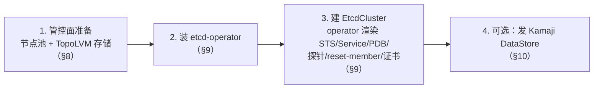
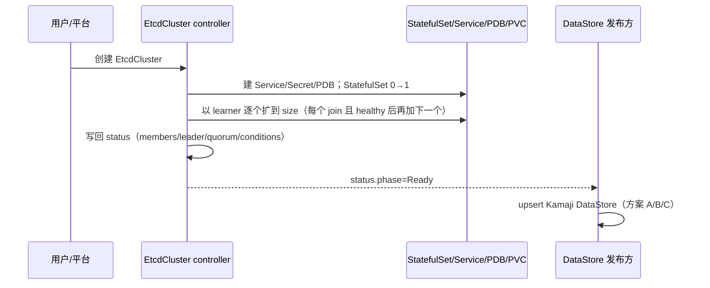
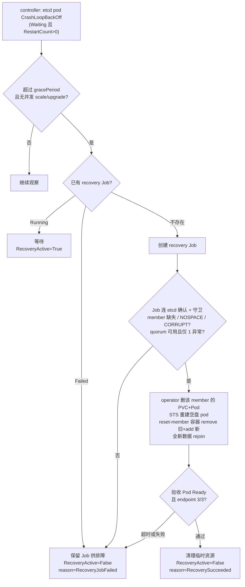

# ACP HCP etcd 高可用设计

## 1. 背景介绍

ACP Hosted Control Plane（**ACP HCP**）是 Alauda 基于 Kamaji 和 Cluster API（CAPI）的托管控制面方案：把多个集群的控制面组件（kube-apiserver、etcd 等）作为 workload 跑在同一个 management 集群上、按租户隔离，从而降低控制面成本。

当前已具备基础形态，但尚未生产可用，缺口集中在 etcd：

- **etcd 自身的高可用**；
- **节点升级时 etcd 服务不中断**；
- **etcd 版本安全升级**；
- **etcd 备份与恢复**。

本设计对标 OCP HCP（HyperShift，§4）：本期落地前三项的高可用能力，并给出备份恢复方案（etcd snapshot + Velero），自动化与具体手册列入后续。范围见 §2。

## 2. Goal / Non-Goal

**Goal（本期）**

- `EtcdCluster` 从「能扩缩容」提升到「节点升级时高可用」。
- 支持 etcd 版本升级。
- 接入 Kamaji（发布 DataStore 供 hosted apiserver 连接）。
- 明确备份恢复方案：etcd snapshot 备数据 + Velero 备控制面 namespace 资源（§13）。

**Non-Goal（本期不做，自动化见 §15）**

- 备份 / 恢复**自动化**：定期快照调度、自动 restore（本期只定方案，§13）。
- quorum 丢失后的**自动**恢复（恢复方案见 §13）。
- 备份恢复的**具体操作手册**（命令 / 参数 / 对象存储配置）——单独整理。
- TLS 证书自动轮换。
- 自动 defrag。
- 永久换机 / local PV 迁移（节点被永久替换、本地盘数据丢失后的重建）。

## 3. 总结

四件事，对应四条保证：

**1. HCP 专用节点 + 专有 label。** 单独建 CAPI MachineDeployment，节点打 `cpaas.io/hcp-management-node: "true"`；`EtcdCluster` 用 nodeSelector 把 etcd 调度到这批节点，与其他 workload 分开。（§8.1、§9.3）

**2. TopoLVM 本地存储 + 换机复用盘。** TopoLVM 给每个节点从专用磁盘切本地卷；ACP Baremetal Provider 保证换机时新节点复用旧节点的 **IP、hostname、持久盘**，TopoLVM 按节点 IP 识别、原样重挂 VG/LV——**数据可复用，etcd 带原数据 rejoin、而非清空重建。**（§8.2）

**3. PDB + etcd readiness 探针，全程不丢 quorum。**

- **PDB**（`maxUnavailable: 1`）：任一时刻最多中断 1 个成员。
- **readyz 探针**：成员「已启动且是有效投票成员（非 learner）」才算就绪。
- 合起来＝**一次只动一个，动下一个前先确认上一个是健康投票成员**。（§9.2、§9.4）

**4. 升级超时（>2h 未完成）需人工介入。** 取舍是宁可让升级一直等，也绝不冒丢 quorum 的风险。如某成员没就绪、PDB 不满足时，drain 的驱逐被一直拒绝、`Machine` 卡 `Deleting`、`MachineDeployment` 长期不 ready；而 **MD 没有超时自动报错（置 Failed）的机制**，需运维盯着，按「Machine → PDB → 哪个成员没就绪」排查。（§12.3）

## 4. 对标：OCP 如何保证 etcd 生产可用

HyperShift 把每个 hosted 控制面的 etcd 以 StatefulSet（默认 3 成员）跑在 management 集群。从四个方面看 OCP 怎么让它达到生产可用：

**1. 部署（节点拓扑与隔离）。** management 节点拓扑分三挡，隔离强度递增：

| 档位 | 隔离强度 | 关键机制 |
| --- | --- | --- |
| Shared Everything | 无（默认） | 所有 hosted cluster 控制面 Pod 共享 management 节点 |
| Shared Nothing | 节点级 | `hypershift.openshift.io/cluster` taint + label 把不同 hosted cluster 隔离到独占节点 |
| Dedicated Request Serving | 节点 + zone 级 | 单个 hosted cluster 在 2 zone 各预留 1 节点，专门承载 kube-apiserver 等前端组件 |

ACP 对应做法见 §8：用专用节点池 + label 把 etcd 隔离到 HCP 管控节点，相当于 Shared Nothing 这一挡。

**2. HCP managed 节点升级。** 升级 HCP managed 节点和升级普通节点走的是同一套 CVO + MCO（CVO 编排、MCO 逐个 drain / 替换节点 / 重启），对 HCP managed 节点没有任何特殊处理；节点 drain 受 PDB 约束也不是 etcd 独有的。

**3. etcd 版本升级。** etcd 版本随控制面 release 走：改 StatefulSet 镜像 → RollingUpdate 逐成员滚动、靠 readyz 串行；遵循 etcd 逐个 minor 递进、不跨 minor、基本不降级的约束。

**4. etcd HA 机制**（3 成员 StatefulSet，下面几层保证节点滚动 / 维护时不丢 quorum）：

| HA 机制 | OCP 做法 |
| --- | --- |
| 状态可观测 | 把 member / leader / health / quorum 汇聚进 status |
| 就绪探针 | `:9980` `/readyz`（**本地 serializable 健康检查**，由 `cluster-etcd-operator readyz` sidecar 提供）/ `/healthz`；不依赖 quorum——否则一个 peer 挂了会让其他健康成员一起翻成 NotReady。**不检查 learner** |
| 调度分散 | anti-affinity + topology spread，把成员分散到不同节点 / 故障域 |
| PDB | HA 下 `maxUnavailable:1` + `unhealthyPodEvictionPolicy:AlwaysAllow` |
| 低延迟存储 | **local PV / LVM**；StorageClass 动态供给、`reclaimPolicy:Delete`，每个节点给 etcd 一块专用快盘 |
| 成员级自愈 | `--enable-etcd-recovery`（默认开）：单个成员失败（quorum 还在）时删掉它的 PVC+Pod，重新供给空盘后由 `reset-member` initContainer 先 remove 再 add，干净地重新加入 |
| 自动 defrag | 仅 HA 下运行 `etcd-defrag-controller`，一次只下线一个成员做整理 |

后续以这四个方面为基准盘点差距（§5）、给出改造（§8–§10）。

## 5. 差距盘点

`EtcdCluster` 底层 etcd 原语已具备，HA 层大多缺失：

| OCP 机制 | 现状 | 差距 |
| --- | --- | --- |
| 成员增删 / learner（原语） | ✅ `internal/etcdutils` 的 Add/Remove/Promote，**仅扩缩容用** | 无 |
| health / leader 探测 | ✅ 有，但仅 reconcile 内存用、未持久化 | 写进 status |
| 状态可观测 | ❌ 子资源已通，但 `EtcdClusterStatus` 空、从不写回 | 补 status 字段并写回 |
| 就绪探针 | ❌ 无 probe，Running 即 Ready | 加 readyz 探针 |
| 调度分散 | ❌ `podTemplate` 仅 metadata | 扩 podTemplate 调度字段 |
| PDB | ❌ 无 | 新增 |
| 低延迟存储 | ✅ `storageSpec.storageClassName` 支持 | 明确 SC 动态供给 + `reclaimPolicy:Delete`，优先 local/LVM |
| 成员级自愈 | ❌ 异常 member 只 requeue、不自动移除重建 | 新增单 member 恢复 |
| 自动 defrag | ❌ 无 | 后期 |
| 接入消费方 | ❌ 仅 headless Service（名 `<name>`） | 加 `<name>-client` Service + DataStore |

> TLS 已有 `cert-manager`（`auto` 待实现），Secret 命名 `<name>-{client,server,peer}-tls`，复用。
> 差距两块：通用 HA（§9，落 `EtcdCluster`、可回上游）+ 管控面配套（§8）；Kamaji 接入（§10，可选）。

## 6. EtcdCluster CRD

底层集群对象，controller 据此渲染 StatefulSet / Service / ConfigMap / Secret / PVC（增强后含 PDB / `:9980` readyz / reset-member / client Service）并维护成员与状态。HA 改造只补字段：

| spec 字段 | 说明 | 状态 |
| --- | --- | --- |
| `size` | member 数；奇数，默认 3 | 现有 |
| `version` | etcd 版本（改它即触发版本升级，§7.2） | 现有 |
| `imageRegistry` | 私有 / 离线仓库 | 现有 |
| `storageSpec` | StorageClass + 容量（`volumeSizeRequest` 必填）；SC 约定见下 | 现有 |
| `tls` | 证书供给（`cert-manager` / `auto`） | 现有 |
| `etcdOptions` | 透传 etcd 启动参数 | 现有 |
| `podTemplate` | 调度：nodeSelector / tolerations / affinity / topologySpreadConstraints | **扩展**（当前仅 metadata） |
| `recovery` | 单 member 自动恢复开关与时限 | **新增** |

**StorageClass 约定**：动态供给 PV、`reclaimPolicy:Delete`（自愈删异常 PVC 后回收旧盘、重供空盘）；local/LVM 用 `volumeBindingMode:WaitForFirstConsumer`（PV 随 pod 调度、nodeAffinity 绑 hostname）。勿用「静态绑定 + `Retain`」承载自愈链路。

> **存储形态（对标 OCP）**：`volumeClaimTemplates` 给每个 member 独占一个 PV（RWO）。OCP 给每个控制面节点配 etcd 专用快盘（NVMe/SSD）、用 LVM local SC（thin pool）切成每 pod 一个 LV；故同节点上不同集群各有独立 PV、共用底层物理盘——① noisy-neighbor（同盘争 IOPS，`fdatasync`<10ms，靠盘快 + 容量规划）；② 物理盘是共享故障域，但每集群 3 成员经 anti-affinity 散到 3 节点 3 盘，单盘故障每集群只丢 1 个。**硬性规则：同集群两成员不落同一物理盘。**

`status` 由 controller 维护（§9.1）。

## 7. 总体部署与升级流程

### 7.1 部署流程（概览）



1. **管控面准备**（§8）：建专用节点池（CAPI MachineDeployment + label），规划 IP/hostname/持久盘，装 TopoLVM（SC `sc-topolvm-vdc`）。
2. **装 etcd-operator**（§9）：带本设计 HA 改造（status / readyz / 调度字段 / PDB / reset-member / client Service / 自愈）。
3. **建 EtcdCluster**（§9、§14）：`size:3`、`storageClassName: sc-topolvm-vdc`、nodeSelector 选中管控节点 + 节点级 anti-affinity；operator 以 learner 逐个扩到 size（§11.1）。
4. **（可选）发 DataStore**（§10）：`status.phase=Ready` 后 upsert。

### 7.2 升级流程（概览）

两类升级，各自串行、互不并发：

| 升级 | 触发 | 机理 | 串行靠 | 详见 |
| --- | --- | --- | --- | --- |
| **节点滚动升级** | 管控集群升级 / 节点配置变更 | CAPI 逐个换 Machine（新机复用 IP/hostname/盘）→ drain 守 PDB → member 带原数据 rejoin | **PDB**（节点 drain 走 Eviction） | §8.3、§12 |
| **etcd 版本升级** | 改 `EtcdCluster.spec.version` | operator 下发新镜像 → StatefulSet RollingUpdate 逐序号 → 数据盘保留、新二进制重启 rejoin | **readyz 探针**（非 PDB，§9.4） | §9.5、§12 |

**两条保证（共用、缺一不可）**：

- **PDB**——中断某成员前保证其余实例都可用：任一时刻最多 1 个被中断，quorum 不丢。
- **readyz**——成员真正启动且是有效投票成员（非 learner）才算就绪，就绪了才放行动下一个。

合起来＝**一次只动一个，动下一个前确认上一个是健康投票成员**，这是升级不丢 quorum 的核心。

- **节点滚动**：ACP 节点是 MicroOS，只滚动换机、不原地升级；换机复用 IP/hostname/数据盘（§8.2），故成员带原数据 rejoin、非重建；一次一节点（PDB `maxUnavailable:1`）。
- **版本升级**：etcd 只支持逐个 minor 滚动、基本不支持降级；逐级升由流程保证，operator 硬校验只拦降级（§9.5）。数据盘在 → reset-member 不触发。
- **升级与自愈不冲突**：滚动期间成员逐个重启、短暂下线属正常，故单成员自愈有守卫——**STS 滚动更新时不启动恢复**（§11.2），避免误判为故障去删 PVC 重建、与升级抢同一个 pod 危及 quorum。

> 失败/卡住行为、人工介入、排查——见 §12。

## 8. 高可用改造（一）· 管控面

HCP 管控节点与本地存储由管控面（CAPI + 存储插件）提供，是 etcd HA 的地基。

### 8.1 管控节点池

单独建 **CAPI MachineDeployment**，节点打 **`cpaas.io/hcp-management-node: "true"`**（标识 + 供 nodeSelector 选中，§9.3）。在 **MachineConfigPool** 提前规划每节点的 **IP、hostname、etcd 本地存储用的持久盘**（如 `/dev/vdc`）——这三者是换机后成员带原数据 rejoin 的基础（§8.2）。

### 8.2 TopoLVM 本地存储 + 换机复用盘

装 **Alauda Container Platform Storage Essentials** + **Alauda Build of TopoLVM**，然后：

- 建 **TopolvmCluster CR**，按节点 IP 指定每节点用哪块盘（`useAll*: false` 显式选盘选节点）：
  ```yaml
  apiVersion: topolvm.cybozu.com/v2
  kind: TopolvmCluster
  metadata: { name: topolvm }
  spec:
    useAllNodes: false
    useAllDevices: false
    useLoop: false
    storage:
      deviceClasses:
        - nodeName: 192.168.128.116
          classes: [{ className: vdc, default: true, devices: [{ name: /dev/vdc, type: disk }] }]
        - nodeName: 192.168.132.219
          classes: [{ className: vdc, default: true, devices: [{ name: /dev/vdc, type: disk }] }]
        - nodeName: 192.168.142.230
          classes: [{ className: vdc, default: true, devices: [{ name: /dev/vdc, type: disk }] }]
  ```
- 建 **StorageClass `sc-topolvm-vdc`**：动态供给、`reclaimPolicy:Delete`、`volumeBindingMode:WaitForFirstConsumer`、`device-class:vdc`：
  ```yaml
  apiVersion: storage.k8s.io/v1
  kind: StorageClass
  metadata:
    name: sc-topolvm-vdc
    labels: { topolvm.storageclass: default }
  provisioner: topolvm.cybozu.com
  parameters:
    csi.storage.k8s.io/fstype: xfs
    topolvm.cybozu.com/device-class: vdc
  reclaimPolicy: Delete
  volumeBindingMode: WaitForFirstConsumer
  allowVolumeExpansion: true
  ```
  一节点一专用盘 → 一节点一成员 → 落实 §6 硬性规则（同集群两成员不落同盘）。

**复用盘的基础设施保证**：ACP **Baremetal Provider 保证换机后新节点复用旧节点的 IP、hostname、持久盘**，故升级时 TopoLVM 无需变更、按节点 IP 识别，`/dev/vdc` 的 VG/LV 原样重挂；配合 `WaitForFirstConsumer` 的 PV（hostname nodeAffinity 仍匹配），成员换机后带原数据 rejoin。若用换机即清空的临时盘，则每次升级丢数据、退化为重建（§15）。

### 8.3 CAPI 节点 drain 必须守 PDB（`nodeDrainTimeout`）

CAPI 滚动升级 = 逐个删旧 Machine、起新 Machine。**删 Machine 前 drain 节点、走 Eviction API → 受 PDB 约束**：若驱逐某成员会破坏 PDB（§9.4），eviction 被拒、drain 每 20s 重试、Machine 卡 `Deleting`。是否最终强删取决于 `nodeDrainTimeout`：

- **`0` / 未设（默认）= 无限 drain**：永不强删，PDB 一直拦到其余成员全 Ready → **安全**（代价：可能卡住、需人工修 etcd，§12）。
- **设了超时且到期**：CAPI **放弃 drain、照删 Machine**（甚至 `--disable-eviction` 绕过 PDB）→ **破坏 quorum**。

> **硬性要求：`nodeDrainTimeout` 必须为 `0`。** `0` 是默认值，只要别设成非 0 即可；已设非 0 的必须改回。**底线：PDB 不满足时绝不允许 drain 节点**——任何非 0 超时都会让 CAPI 到点强删 Machine、绕过 PDB → 丢 quorum。
>
> **在哪确认**：它是 Machine spec 字段——看 etcd 所在节点池（§8.1 MachineDeployment）的 `spec.template.spec.nodeDrainTimeout`（in-place 传播、不触发 rollout）；etcd 在控制面节点则看控制面 provider 的 `spec.machineTemplate.nodeDrainTimeout`。确认为空或 `0`/`0s`。较新 CAPI 该字段在 `deletion` 块（`…spec.deletion.nodeDrainTimeout`）。

## 9. 高可用改造（二）· etcd-operator

多数数据 / 逻辑已在进程内，主要是补字段与持久化。

### 9.1 填充 `status`

**现状**：status 子资源已通，但 `EtcdClusterStatus` 空、从不写回；每轮 reconcile 现查的 member/health 算完即弃，`kubectl get -o yaml` 看不到状态。
**改造**：reconcile 末尾把内存数据写回 `.status`（数据来自现有 `etcdutils`，只需加字段 + 写回），让运行态可见可排查（§12.1）：

```yaml
status:
  phase: Ready
  readyReplicas: 3
  memberCount: 3
  leaderID: "abc"
  members:
    - { name: branch-a-etcd-0, id: "abc", healthy: true, leader: true, learner: false, nodeName: node-a }
  recovery: { active: false, lastResult: Succeeded, lastRecoveredMember: branch-a-etcd-2 }
  conditions:
    - { type: EtcdClusterCreated,         status: "True" }
    - { type: EtcdClusterReady,           status: "True" }
    - { type: DataStoreReady,             status: "True" }
    - { type: QuorumAvailable,            status: "True" }
    - { type: SingleMemberDegraded,       status: "False" }
    - { type: SingleMemberRecoveryActive, status: "False" }
```

### 9.2 etcd 就绪探针

当前**无 probe**——Running 即 Ready，而 PDB / drain 安全 / healthy 计数 / 版本升级串行都依赖 Ready。需让 **Ready = 成员在服务且有投票资格**：不直接 httpGet etcd，而起一个 **`:9980` HTTPS 健康 server**（sidecar 或 operator），probe 打它：

- **liveness `GET :9980/healthz`**（period 5s / failureThreshold 5 / timeout 30s）：只探活、宽容。
- **readiness + startup `GET :9980/readyz`**（readiness period 5s / failureThreshold 15；startup period 10s / failureThreshold 18）。
- `/readyz` 核心 = **本地 serializable 健康检查**：对本地 etcd `Get("health", WithSerializable())`、**不依赖 quorum**——否则一个 peer 挂会让其他健康成员一起 NotReady、放大故障；linearizable（默认 `/health`）丢 quorum 会误判全部。OCP 即用 `cluster-etcd-operator readyz` sidecar 这套逻辑。
- **再加一条「非 learner」判定**（OCP readyz 不查 learner，learner 也会判 Ready）：让 learner 在 promote 前保持 **NotReady**——不被 PDB 计为健康、不被 client Service 命中（`IsLearner` 本地可查、不依赖 quorum）。不需要可退回纯 OCP readyz。

> readyz 只证「本地在服务 / 有投票资格」、不证「quorum 健康」——故 PDB 仍保守（§9.4），recovery 的 quorum 判断走 controller 侧 `etcdutils`。

### 9.3 扩展 `podTemplate` 调度字段

增加 `nodeSelector` / `tolerations` / `affinity` / `topologySpreadConstraints`，平台侧填。ACP 推荐 **`nodeSelector: cpaas.io/hcp-management-node: "true"`**（§8.1）+ hostname topology spread + 节点级 anti-affinity（避免「2 zone / 3 member」时第 3 个 Pending）。

### 9.4 PDB

按 size 生成（3 → `maxUnavailable:1`）+ `unhealthyPodEvictionPolicy:AlwaysAllow`：健康成员受 budget 约束；NotReady / 卡死成员在 drain 时可被驱逐、不阻塞维护。前提是 §9.2 探针可靠；quorum 与恢复准入仍由 controller 侧 member health 判断。

> 3 成员 `maxUnavailable:1`（=`minAvailable:2`）最多挂 1 个、保住 quorum。**PDB 只对走 Eviction 的自愿驱逐生效**（节点 drain，§8.3）；STS 滚动直接删 Pod、不经 Eviction → 不受 PDB 约束，版本升级串行靠 readyz（§9.5）。

### 9.5 etcd 版本升级（改 `spec.version`）

operator 每轮 `CreateOrPatch` 把新镜像下发 → 默认 **RollingUpdate** 逐序号滚动，数据盘保留、带原数据用新二进制重启（reset-member 不触发）。

- **串行靠 readyz、不是 PDB**：STS 滚动直接删 Pod、不走 Eviction、不受 PDB；是 §9.2 readyz（healthy + 非 learner）让「每个成员真就绪后才升下一个」，一次只动一个、quorum 保持。
- **版本约束**：
  - **必须逐个 minor 递进**（如 3.4→3.5→3.6，不跳 minor）。**原因**：滚动期间集群处于**混版**，而 etcd 只保证相邻 minor（N 与 N+1）兼容（wire 协议、存储/快照格式、cluster version）。跨 minor 会让相隔两个 minor 的成员在混版窗口共存，属 etcd **unsupported**：新版成员可能起不来 / 无法加入、甚至损坏数据。逐级升保证任一时刻混版只差一个 minor。
  - **基本不支持降级**（仅个别版本有受限流程）。
  - **落地**：逐级递进由升级流程保证；operator **硬校验拦降级**（防误改小），跨 minor 前进可选加 guard。
- **升级中不误判**：§11.2 守卫含「无并发 scale/upgrade（STS 滚动中）」。

### 9.6 reset-member initContainer

每个 etcd pod 注入 init 容器，按**数据盘上有没有 etcd db** 决定——这是「带原数据 rejoin」与「丢数据后干净重入」的开关：

- `/var/lib/etcd/member/snap/db` **存在** → 数据在，**不动**，带原数据 rejoin（换机 / 版本升级常态）。
- **不存在**（空盘）→ 若集群可达且成员表里还挂同名旧 member，则 `member remove` 旧 ID + `member add` 新 peer（`initial-cluster-state=existing`）干净加入。**只对齐成员表、不删 PVC**。

与 operator 删 PVC 的分工见 §11.2：operator 清数据、reset-member 对齐成员表。

### 9.7 client Service

现有 headless `<name>`（`ClusterIP:None`、`PublishNotReadyAddresses:true`、无端口）给 **peer 发现**用，故意解析未就绪 pod，不适合客户端。OCP 也分两个 Service（`etcd-discovery` 发现 / `etcd-client` 连），我们缺后者。**改造**：新增 `<name>-client`——headless、**`publishNotReadyAddresses:false`**、2379 端口；用 headless 让客户端拿到所有就绪成员做 failover，「只命中健康成员」靠 §9.2 探针。DataStore `endpoints` 用 `<name>-client.<ns>.svc:2379`。

### 9.8 单 member 自动恢复（开关）

轻量配置；破坏性动作放一次性 Job（仿 HyperShift），controller 读 Job `Complete/Failed` 同步 status。流程见 §11.2。

```yaml
spec:
  recovery:
    enabled: true
    gracePeriod: 10m     # 异常持续多久才恢复，避免 reboot 误判
    timeout: 30m
    maxRetries: 3
```

## 10. 高可用改造（三）· DataStore 发布（ACP 专属，可选）

DataStore 是连接器对象，内容固定：

```yaml
apiVersion: kamaji.clastix.io/v1alpha1
kind: DataStore
metadata: { name: branch-a-etcd }      # cluster-scoped，名称需全局唯一
spec:
  driver: etcd
  endpoints: [ branch-a-etcd-client.hcp-system.svc:2379 ]   # 来自 §9.7 client Service
  tlsConfig:                             # 指向 <name>-client-tls 与其 CA
    certificateAuthority: { ... }
    clientCertificate: { ... }
```

endpoint 与证书 Secret 命名稳定可预测，故「谁来生成」可替换，三种放法：

| 方案 | 形态 | 取舍 |
| --- | --- | --- |
| **A. 手动 / 声明式** | `kubectl apply` 或部署模板写死 | 零代码、最简方案；适合集群少、不频繁变动 |
| **B. Kamaji provider 里 watch** ✅ 倾向 | 放进 `cluster-api-control-plane-provider-kamaji`，watch `EtcdCluster`、`status.phase=Ready` 后 upsert | 职责归位：etcd-operator 不碰 Kamaji 类型、保持可上游；`usedBy` / 删除保护 / schema 绑定更直接 |
| **C. operator 内独立 reconciler** | 与核心 reconciler 解耦，build tag / 开关控制 | 同进程读 status 最直接，但给 fork 引入 Kamaji 依赖 |

**触发**（B/C）：watch EtcdCluster + annotation（`hcp.alauda.io/datastore: <name>`），或 provider 从 `KamajiControlPlane` 反查。三者对 `EtcdCluster` 透明、可切换，都不给 `spec` 加 Kamaji 字段。`dataStoreSchema`（db 名 / key prefix）属 Kamaji 控制面，唯一性绑定时校验。

## 11. 工作流程

### 11.1 创建



1. 平台建 `EtcdCluster`（带 HA 调度字段，按需带 `hcp.alauda.io/datastore` annotation）。
2. controller 建 Service / Secret / PDB；StatefulSet 0→1，再以 learner 逐个扩到 `size`——每个 join 且 healthy 后才加下一个，保证扩容期 quorum 安全。
3. 把 member / leader / health / quorum 写回 `status`。
4. `status.phase=Ready` 后，发布方按 A/B/C upsert DataStore。

### 11.2 单 member 自动恢复

> **作用域（ACP 与 OCP 的差异）**：ACP 换机后 PV/PVC 仍在、数据盘原样挂回（§8.2），成员拿原数据重建 pod 即**自动 rejoin**（reset-member no-op，§9.6）——绝大多数节点变更用不到本节。**自动恢复只处理「数据真坏了 / 丢了」**（如盘挂回但 etcd 加载 db 失败、CrashLoop）。OCP 把它当常规手段，是因其换机≈丢盘、必须重建成员；ACP 靠复用盘规避了这点。

**检测（两段式）**：

- **触发**（controller，纯看 k8s 状态）：某 etcd pod CrashLoopBackOff（`State.Waiting` 且 `RestartCount>0`）即触发，不连 etcd。
- **确认**（recovery Job，连 etcd）：查 `MemberList`（谁缺失）+ 逐成员 `Get("health")` 与 `AlarmList`（`NOSPACE`/`CORRUPT`）+ failing pod，任一成立判 unhealthy。

> 判健康用 **pod 重启状态 + etcd alarm**，不是 §9.2 探针。OCP 触发即动手；我们加 `gracePeriod` 去抖，避免把 reboot / 短暂 drain 误判。

**operator 删 PVC 与 reset-member 的分工**（必须 operator 先）：operator 仅在自愈路径（守卫见下）删该成员 PV+PVC+Pod（正常 reboot/换机/升级不删）→ STS 重建空盘 pod → reset-member 因盘空进入 remove+add。即 **operator 删 PVC 正是把 reset-member 从「数据在→no-op」切到「数据空→重置成员」的开关**：operator 清数据（有全局守卫），reset-member 对齐成员表（pod 本地、幂等）。init 容器不能自删 PVC（finalizer 拦 + 无守卫易误删）；remove→add 间成员表短暂 3→2，故守卫坚持仅 1 异常。

<details>
<summary>recovery Job 健康检查 YAML 示例</summary>

```yaml
apiVersion: v1
kind: ServiceAccount
metadata:
  name: etcd-health-check
  namespace: hcp-system
---
apiVersion: rbac.authorization.k8s.io/v1
kind: Role
metadata:
  name: etcd-health-check
  namespace: hcp-system
rules:
  - apiGroups: [""]
    resources: ["pods"]
    verbs: ["get", "list"]
---
apiVersion: rbac.authorization.k8s.io/v1
kind: RoleBinding
metadata:
  name: etcd-health-check
  namespace: hcp-system
subjects:
  - kind: ServiceAccount
    name: etcd-health-check
    namespace: hcp-system
roleRef:
  apiGroup: rbac.authorization.k8s.io
  kind: Role
  name: etcd-health-check
---
apiVersion: batch/v1
kind: Job
metadata:
  name: etcd-health-check
  namespace: hcp-system
spec:
  backoffLimit: 0
  template:
    spec:
      restartPolicy: Never
      serviceAccountName: etcd-health-check
      containers:
        - name: check
          # 示例镜像需同时包含 etcdctl 与 kubectl。
          image: your-image-with-etcdctl-and-kubectl:latest
          command:
            - /bin/bash
            - -c
            - |
              set -euo pipefail

              export ETCDCTL_API=3
              unhealthy=0

              etcdctl_one() {
                local ep="$1"
                shift
                etcdctl \
                  --endpoints="${ep}" \
                  --cacert="${ETCDCTL_CACERT}" \
                  --cert="${ETCDCTL_CERT}" \
                  --key="${ETCDCTL_KEY}" \
                  "$@"
              }

              echo "== etcd health/alarm check =="
              for i in $(seq 0 $((ETCD_REPLICAS - 1))); do
                ep="${ETCD_SCHEME}://${ETCD_STS_NAME}-${i}.${ETCD_HEADLESS_SERVICE}.${ETCD_NAMESPACE}.svc.cluster.local:2379"
                echo "checking ${ep}"

                if ! etcdctl_one "${ep}" get health --consistency=s >/dev/null; then
                  echo "[UNHEALTHY] Get(\"health\") failed on ${ep}"
                  unhealthy=1
                fi

                if ! alarm_out="$(etcdctl_one "${ep}" alarm list 2>&1)"; then
                  echo "[UNHEALTHY] AlarmList failed on ${ep}"
                  echo "${alarm_out}"
                  unhealthy=1
                elif echo "${alarm_out}" | grep -E '\b(NOSPACE|CORRUPT)\b' >/dev/null; then
                  echo "[UNHEALTHY] critical alarm found on ${ep}:"
                  echo "${alarm_out}"
                  unhealthy=1
                fi
              done

              echo "== pod check =="
              if ! pod_lines="$(kubectl -n "${ETCD_NAMESPACE}" get pods -l "${ETCD_POD_SELECTOR}" --no-headers 2>&1)"; then
                echo "[UNHEALTHY] failed to list etcd pods"
                echo "${pod_lines}"
                unhealthy=1
              else
                bad_pods="$(
                  echo "${pod_lines}" | awk '
                    {
                      split($2, ready, "/")
                      if ($3 != "Running" || ready[1] != ready[2]) print $0
                    }
                  '
                )"
                if [[ -n "${bad_pods}" ]]; then
                  echo "[UNHEALTHY] failing/unready pods:"
                  echo "${bad_pods}"
                  unhealthy=1
                fi
              fi

              if [[ "${unhealthy}" -ne 0 ]]; then
                echo "RESULT: unhealthy"
                exit 1
              fi
              echo "RESULT: healthy"
          env:
            - { name: ETCD_NAMESPACE,        value: hcp-system }
            - { name: ETCD_STS_NAME,         value: branch-a-etcd }
            - { name: ETCD_HEADLESS_SERVICE, value: branch-a-etcd }
            - { name: ETCD_REPLICAS,         value: "3" }
            - { name: ETCD_SCHEME,           value: https }
            - { name: ETCD_POD_SELECTOR,     value: app.kubernetes.io/instance=branch-a-etcd }
            - { name: ETCDCTL_CACERT,        value: /etc/etcd/tls/ca.crt }
            - { name: ETCDCTL_CERT,          value: /etc/etcd/tls/tls.crt }
            - { name: ETCDCTL_KEY,           value: /etc/etcd/tls/tls.key }
          volumeMounts:
            - { name: etcd-client-tls, mountPath: /etc/etcd/tls, readOnly: true }
      volumes:
        - name: etcd-client-tls
          secret:
            secretName: branch-a-etcd-client-tls
```

</details>

**守卫**：仅当 quorum 可用、恰好 1 成员异常、且无并发 scale/upgrade（STS 不在滚动）时才恢复。



1. controller 检测某 etcd pod CrashLoopBackOff（`Waiting` 且 `RestartCount>0`）。
2. 持续超 `gracePeriod` 且无并发 scale/upgrade/recovery；否则继续观察。
3. 按 recovery Job 状态：Running 等待；Failed 保留供排障、不重试；不存在则创建。
4. Job 连 etcd 确认并守卫：member 缺失或 `NOSPACE`/`CORRUPT` 判异常；quorum 不可用或 ≥2 成员异常 → Job 失败（需人工）。
5. 恢复：**operator 删**该成员 PVC（`etcd-data-<pod>`）+ Pod → SC 按 `Delete` 回收旧 PV → STS 重建**空盘** pod；**reset-member** 因盘空 `member remove`(旧) + `member add`(新) → 全新数据 rejoin。
6. 验收 Pod Ready、endpoint health 3/3。
7. 通过则清理、置 `RecoverySucceeded`、更新 `status.recovery`；超时/失败置 `RecoveryJobFailed`、不重试。

≥2 成员异常或 quorum 丢失：只告警，不自动恢复。

## 12. 可观测与运维

### 12.1 哪里看实时状态

| 看什么 | 命令 / 位置 |
| --- | --- |
| 节点 / 换机进度 | `kubectl get machines`（CAPI Machine `phase`；卡在 `Deleting` = drain 被 PDB 拦住，§8.3）、`kubectl get nodes` |
| etcd 集群运行态 | `kubectl get etcdcluster <name> -o yaml` → `status`：`phase` / `members[]`(healthy/leader/learner/nodeName) / `leaderID` / `recovery` / `conditions`（§9.1） |
| etcd 直连核对 | `etcdctl member list -w table`（缺谁 / learner）、`endpoint health`、`endpoint status`（leader/raftTerm）、`alarm list`（NOSPACE/CORRUPT） |
| 就绪 / quorum | Pod Ready（= readyz：healthy + 非 learner，§9.2）；`QuorumAvailable` condition |
| PDB | `kubectl get pdb <name>`（`ALLOWED DISRUPTIONS`=0 即正在拦驱逐） |
| 自愈 | `status.recovery`、recovery Job（`kubectl get job`）、reset-member 容器日志（§12.4） |

### 12.2 升级失败 / 卡住的行为（不是崩溃重试，是稳定等待）

- **节点滚动**：PDB 拒绝违反预算的驱逐 → **Machine 卡 `Deleting`、每 20s 重试 drain**（稳定等待、非崩溃循环）。`nodeDrainTimeout=0` → 无限等到放行；**超时到期 → CAPI 强删、破坏 quorum**（故须为 0，§8.3）。
- **版本升级**：某成员 readyz 不过 → **STS 停在该序号、不前进**（无 PDB，由 readyz 把关）；恢复就绪才继续。
- **单成员自愈**：recovery Job `Failed` → **保留供排障、不重试**；`gracePeriod` 内抖动不触发。
- **降级被拒**：硬校验拒绝、不进入滚动；跨 minor 前进由流程逐级保证（§9.5）。

### 12.3 何时需要人工介入

| 触发 | 现象 | 处置 |
| --- | --- | --- |
| **升级长时间未完成**（经验值：**>2h** MachineDeployment 仍未 fully ready） | MD `updatedReplicas`/`readyReplicas` 长期 < `replicas`。注意 **MD 没有「超时自动把 `status.phase` 置 `Failed`」的机制**（不像 ModuleInfo），它不会自己报错 | 看 **MD `status` + etcd-operator 日志**，顺着 §12.4：Machine `DrainingSucceeded` → PDB → 哪个 member 没就绪 |
| **quorum 丢失（≥2 member 异常）** | `QuorumAvailable=False`；自愈只告警不动手 | 按 §13 恢复方案走 snapshot 恢复，期间 API 不可用 |
| **节点 drain 长期卡住** | Machine 卡 `Deleting`、PDB `ALLOWED DISRUPTIONS=0` | 查其余 member 为何没 Ready；等 §11.2 自愈 / 人工修复，**切忌 force delete 跳过 PDB / 误设 `nodeDrainTimeout`** |
| **recovery Job Failed** | `reason=RecoveryJobFailed`、不自动重试 | 看 Job 日志定位，手动修复后删 Job 重试 |
| **数据盘没重挂** | reset-member 反复 `removing/Adding`、member 反复全量同步 | 查 Baremetal Provider 是否真复用了旧盘 / hostname（§8.2） |
| **降级被拒** | apply 报错（改小了 version） | 降级基本不支持；如确需，走 etcd 受限降级流程 |

### 12.4 排查手册

- **reset-member 容器日志**：`member has data` = 带原数据 rejoin（常态）；`removing / Adding new member` = 该 member 数据丢失后干净重入（异常，查盘是否真重挂）。
- **member 缺失 / learner 卡住**：`etcdctl member list`；learner 长期不 promote → 查它与 leader 的 revision 差。
- **节点升级不动**：先看 `kubectl get machines` 是否卡 Deleting、再看 `kubectl get pdb`（ALLOWED=0）、再看哪个 member 没 Ready（readyz）。
- **alarm**：`NOSPACE` → 加盘 / defrag；`CORRUPT` → 该 member 走自愈重建（§11.2）。

## 13. 备份与恢复（方案，对标 OCP）

> 本节只讨论**方案与思路**，对标 OCP HCP 的容灾做法；具体操作手册（命令、参数、对象存储配置等）另行单独整理，不在本设计内展开。

核心思路：**两类东西分开备份，恢复时配合**。

- **etcd 数据**（key-value）：用 **etcd snapshot** 备份（对标 OCP `etcdctl snapshot save`）。snapshot 只覆盖数据本身，不含证书 / CR 等资源。
- **hosted 控制面的 k8s 资源**（`EtcdCluster` CR、TLS Secret、ConfigMap、Kamaji `DataStore` / TenantControlPlane 等）：用 **Velero** 备份它们所在的 namespace（对标 OCP 用 OADP，即 Velero，备份 hosted control plane）。

**几个关键取舍**：

- **证书必须纳入资源备份**：etcd 的 peer/server/client 证书（cert-manager 签发的 Secret）是 restore 后成员互信、apiserver 重连的前提，必须跟着 namespace 一起备。
- **不用卷快照**：etcd 的 PV 是 TopoLVM 本地盘，跨节点卷快照不可靠也无必要——数据恢复一律走 etcd snapshot，Velero 只负责 k8s 资源。
- **恢复顺序「先资源、后数据」**：先用 Velero 把 namespace 资源（含 `EtcdCluster` / 证书）拉回来，再用 snapshot 把 etcd 数据灌回去、由 operator 以 learner 逐个扩回 `size`（§11.1）——这也是 §2「quorum 丢失恢复」的落地路径。

本期范围：确定上述方案并验证可行；定期调度、自动 restore 等自动化能力列入 §15，具体手册单独整理。

## 14. 完整示例

带 HA 调度保护、开启恢复的 `EtcdCluster`（annotation 仅方案 B/C 需要）：

```yaml
apiVersion: operator.etcd.io/v1alpha1
kind: EtcdCluster
metadata:
  name: branch-a-etcd
  namespace: hcp-system
  annotations:
    hcp.alauda.io/datastore: branch-a-etcd     # 仅方案 B/C 自动发布时需要
spec:
  size: 3
  version: v3.6.5
  imageRegistry: harbor.alauda.cn/ait
  storageSpec:
    storageClassName: sc-topolvm-vdc           # §8.2 TopoLVM SC（动态供给、reclaimPolicy=Delete）
    volumeSizeRequest: 8Gi
  tls:
    provider: cert-manager
    providerCfg:
      certManagerCfg: { issuerKind: Issuer, issuerName: etcd-issuer }
  podTemplate:                                  # §9.3 扩展的调度字段
    spec:
      nodeSelector: { cpaas.io/hcp-management-node: "true" }   # 选中 HCP 管控节点（§8.1）
      topologySpreadConstraints:
        - { maxSkew: 1, topologyKey: kubernetes.io/hostname, whenUnsatisfiable: DoNotSchedule, labelSelector: { matchLabels: { app: branch-a-etcd } } }
      affinity:
        podAntiAffinity:
          requiredDuringSchedulingIgnoredDuringExecution:
            - { topologyKey: kubernetes.io/hostname, labelSelector: { matchLabels: { app: branch-a-etcd } } }
  recovery: { enabled: true, gracePeriod: 10m, timeout: 30m, maxRetries: 3 }
```

> 管控节点的 CAPI machine 模板须确保 `nodeDrainTimeout` 为 `0`（默认即 0，§8.3）。

## 15. 后期增强

- **备份 / 恢复自动化**：把 §13 方案落地为自动能力——`EtcdCluster.spec` 扩展定期快照（`schedule` / `retention` / `objectStorageRef`）、snapshot CronJob、自动上传与 retention 清理、stale/failed 告警；恢复侧对标 OCP `restoreSnapshotURL` 做半自动 restore。
- **TLS 证书轮换**：当前 `tls` 只是证书供给。轮换：证书 Secret/Certificate 变化 → 确认 quorum healthy → 按 member 串行 reload/rolling restart → 每个恢复后查 endpoint health/member list → 全部完成更新 rotation condition。
- **自动 defrag**：对齐 OCP `etcd-defrag-controller`，按周期 / db 大小阈值串行 defrag，确保 quorum 健康、一次只动一个，仅 HA（size≥3）。
- **永久换机 / local PV 迁移**：节点被永久替换、local PV 丢失（非 §8.2 复用盘）时，在新节点以全新数据重建 member（remove + learner add）并重新供给 PV。比单成员临时恢复更重，单独设计。

## 16. 参考

- 底层实现：`api/v1alpha1/etcdcluster_types.go`、`internal/controller/etcdcluster_controller.go`、`internal/etcdutils/`
- Kamaji CRD：`chart/charts/kamaji/templates/crds/`
- CAPI 节点 drain / PDB / `nodeDrainTimeout`：<https://cluster-api.sigs.k8s.io/tasks/automated-machine-management/machine_deletions>
- OCP HCP / HyperShift hosted etcd：
  - 单 member 自愈 / DR：<https://hypershift.pages.dev/how-to/disaster-recovery/etcd-recovery/>
  - etcd snapshot backup（Tech Preview）：<https://hypershift.pages.dev/how-to/disaster-recovery/etcd-snapshot-backup/>
  - reset-member / 探针 / PDB：`openshift/hypershift` `control-plane-operator/.../v2/{etcd,assets/etcd}`、`support/controlplane-component`
  - `:9980` readyz 实现（serializable Get、**不查 learner**）：`openshift/cluster-etcd-operator` `pkg/cmd/readyz/readyz.go`
  - 存储建议（local / LVM）：<https://docs.okd.io/latest/hosted_control_planes/hcp-deploy/hcp-deploy-virt.html>
  - etcd 健康端点：<https://etcd.io/docs/v3.5/op-guide/monitoring/>
