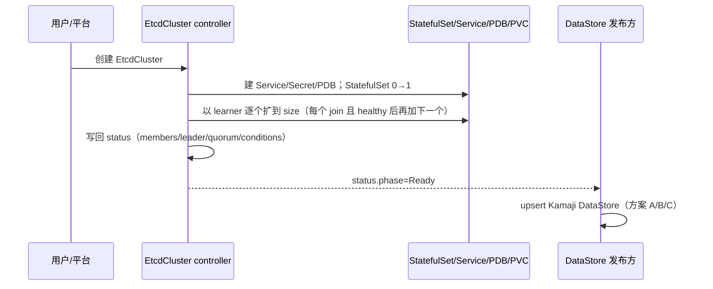
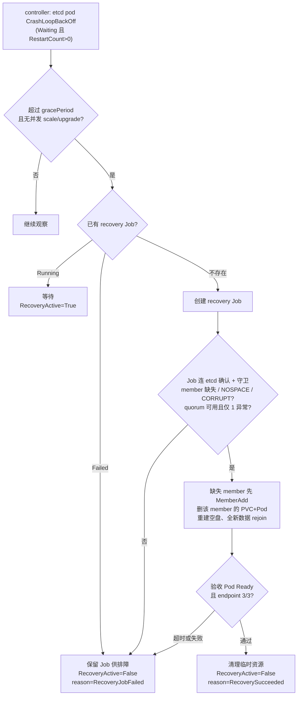

# ACP HCP etcd 设计

> 目标：让 ACP HCP hosted 控制面的 etcd 在 management 节点升级 / 维护（drain、重启、换机）时不中断。以 OpenShift HCP（HyperShift）为对标，盘点差距并补齐。
> 基线：现有 `etcd-io/etcd-operator`（本仓库），etcd `v3.6.5`，CRD `operator.etcd.io/v1alpha1`。

后文「对标 → 盘点 → 改造 → 交付」四张表同序排列，可逐行对照：状态可观测 · 就绪探针 · 调度分散 · PDB · 低延迟存储 · 成员自愈 · 自动 defrag · 接入消费方。

## 1. 目标 / 非目标

**做**：把 `EtcdCluster` 提升到「节点升级时高可用」，并把 etcd 接入 Kamaji。

> **不新增高层 CRD**：要补的（状态、调度、PDB、自愈）都是通用 etcd HA 能力，属于 `EtcdCluster`、可回上游；ACP 专属的只有「发一个 Kamaji DataStore」，不值得单立 CRD。

**当前不做**（见 §11）：quorum 丢失恢复、自动 backup、TLS 证书轮换、自动 defrag、永久换机 / local PV 迁移。

## 2. 对标 OCP HCP（HyperShift）

HyperShift 把每个 hosted 控制面的 etcd 以 StatefulSet 跑在 management 集群（`spec.etcd.managementType: Managed`，默认 3 成员；`Unmanaged` 接外部 etcd）。节点滚动升级时靠以下几层不丢 quorum：

| HA 机制 | OCP 做法 |
| --- | --- |
| 状态可观测 | member / leader / health / quorum 汇聚 status |
| 就绪探针 | sidecar 对 `localhost:2379` 做 **serializable（本地）** 读；不依赖 quorum——否则一个 peer 挂会让健康 member 一起翻 NotReady、放大故障 |
| 调度分散 | anti-affinity + topology spread，member 分散节点 / 故障域 |
| PDB | HA `maxUnavailable:1`；另设 `unhealthyPodEvictionPolicy:AlwaysAllow` 放行驱逐未就绪 pod |
| 低延迟存储 | 高性能持久化，**优先 local PV / LVM**；SC 需支持动态供给 PV，`reclaimPolicy: Delete`，每节点给 etcd 专用快盘 |
| 成员级自愈 | `--enable-etcd-recovery`（默认开）：单 member 失败（quorum 在）删 PVC+Pod，SC 删除旧 PV 并自动重供给空盘后 rejoin |
| 自动 defrag | 仅 HA 跑 `etcd-defrag-controller`，defrag 时短暂下线该 member |

两条边界，决定哪些列入后期：

- **存储 / 节点升级**：local PV 数据钉节点（StatefulSet PVC retention=`Retain`，避免缩容 / 删除集群对象时误删数据；但 SC 的 PV `reclaimPolicy` 仍需 `Delete`，用于显式删 PVC 后自动回收并重供给空盘），故**推荐原地（in-place）升级**；换 / 替节点会让数据失效、被迫重建 member，HA 期间有 quorum 风险。
- **灾难恢复**：单 member 失败可自愈；**quorum 丢失（≥2 挂）** 只能 snapshot 恢复、期间 API 不可用。backup 上 GA 仅手动 snapshot，OADP/Velero 方案仍 Tech Preview（一次性），无内建定时 backup。

## 3. 差距盘点

`EtcdCluster` 底层 etcd 操作已具备，HA 层大多缺失：

| OCP 机制 | 现状 | 差距 |
| --- | --- | --- |
| 成员增删 / learner（原语） | ✅ `internal/etcdutils` 的 Add/Remove/Promote，**仅扩缩容用**（改 `spec.size`） | 无 |
| health / leader 探测 | ✅ 有，但仅 reconcile 内存用、未持久化 | 写进 status |
| 状态可观测 | ❌ 子资源已通，但 `EtcdClusterStatus` 空、从不写回 | 补 status 字段并写回 |
| 就绪探针 | ❌ 无 probe，Running 即 Ready | 加 serializable 探针 |
| 调度分散 | ❌ `podTemplate` 仅 metadata | 扩 podTemplate 调度字段 |
| PDB | ❌ 无 | 新增 |
| 低延迟存储 | ✅ `storageSpec.storageClassName` 支持 | 文档明确 SC 需动态供给 PV、`reclaimPolicy: Delete`，优先 local / LVM SC |
| 成员级自愈 | ❌ 异常 member 只触发 requeue、不自动移除重建（原语在但没编排成自愈） | 新增单 member 恢复 |
| 自动 defrag | ❌ 无 | 后期 |
| 接入消费方 | ❌ 仅 headless Service（名 `<name>`） | 加 `<name>-client` Service + DataStore |

> TLS 已有 `cert-manager`（`auto` 待实现），Secret 命名 `<name>-{client,server,peer}-tls`，直接复用；轮换列后期。节点替换、定时 backup 同 OCP 也是约束 / TP，列后期。

差距分两块：**改造一**补通用 HA（落 `EtcdCluster`，可回上游），**改造二**补 Kamaji 接入（可选）。

## 4. EtcdCluster CRD

底层 etcd 集群对象，controller 据此渲染 StatefulSet / Service / ConfigMap / Secret / PVC（增强后含 PDB）并维护成员与状态。改造一只补字段：

| spec 字段 | 说明 | 状态 |
| --- | --- | --- |
| `size` | member 数；奇数，默认 3 | 现有 |
| `version` | etcd 版本 | 现有 |
| `imageRegistry` | 私有 / 离线仓库 | 现有 |
| `storageSpec` | StorageClass + 容量（`volumeSizeRequest` 必填）；SC 约定见下 | 现有 |
| `tls` | 证书供给（`cert-manager` / `auto`） | 现有 |
| `etcdOptions` | 透传 etcd 启动参数 | 现有 |
| `podTemplate` | 调度：nodeSelector / tolerations / affinity / topologySpreadConstraints | **扩展**（当前仅 metadata） |
| `recovery` | 单 member 自动恢复开关与时限 | **新增** |

**StorageClass 约定**：`storageSpec.storageClassName` 指向的 SC 必须支持动态创建 PV；`reclaimPolicy` 配置为 `Delete`，这样成员自愈显式删除异常 member 的 PVC 后，旧 PV / 底层卷会被回收，StatefulSet 能重新申请一块空盘。local PV / LVM 场景建议 `volumeBindingMode: WaitForFirstConsumer`，让 PV 跟随 pod 调度到目标节点 / 拓扑；不要用只静态绑定且 `Retain` 回收策略的 SC 承载自动恢复链路。

`status` 由 controller 维护（§5.1）。

## 5. 改造一：增强 EtcdCluster（通用 HA，可回上游）

多数数据 / 逻辑已在进程内，主要是补字段与持久化。

### 5.1 填充 `status`

**现状**：status 子资源已接通（`+kubebuilder:subresource:status` + RBAC），但 `EtcdClusterStatus` 是空结构体、controller 也从不写回——每轮 reconcile 现查的 member/health 只用于当轮决策、算完即弃。于是 `kubectl get -o yaml` 看不到任何状态，排查只能翻 controller 日志或手连 etcd。

**改造**：把那份内存数据在 reconcile 末尾写回 `.status`（数据来自现有 `etcdutils`，管道 / RBAC 现成，只需加字段 + 写回），让运行态在资源上**可见、可排查**：

```yaml
status:
  phase: Ready
  readyReplicas: 3
  memberCount: 3
  leaderID: "abc"
  members:
    - { name: branch-a-etcd-0, id: "abc", healthy: true, leader: true, learner: false, nodeName: node-a }
  recovery: { active: false, lastResult: Succeeded, lastRecoveredMember: branch-a-etcd-2 }
  conditions:
    - { type: Available,        status: "True" }   # member 就绪、达到 spec.size
    - { type: QuorumAvailable,  status: "True" }   # healthy member 满足 quorum
    - { type: RecoveryActive,   status: "False" }  # True=单 member 恢复进行中
```

### 5.2 etcd 就绪探针

当前 StatefulSet **无 readiness/liveness probe**——Running 即 Ready，"就绪"≠"在服务"。而 PDB、drain 安全、healthy 计数都依赖 Ready，故需让 **Ready = member 在服务**。参考 OCP，**用 serializable（本地）检查、不用 linearizable（依赖 quorum）**：

- serializable 只确认本地在服务、不依赖 quorum——否则一个 peer 挂会让健康 member 一起翻 NotReady、放大故障。
- readiness 与 liveness 查同一件事，靠阈值区分：readiness 快翻（period 1s、failureThreshold 3），liveness/startup 高容忍（failureThreshold 20/30，startup `initialDelaySeconds:30`）。

实现不必照搬 sidecar：给 etcd 配 `--listen-metrics-urls` 暴露免 client-cert 的 HTTP 端口，httpGet 探 `/health?serializable=true`（v3.6 亦可 `/livez`、`/readyz?exclude=linearizable_read`）。**避免**默认 `/health` 与 `etcdctl endpoint health`（linearizable，丢 quorum 误判全部）。

> serializable 只证"在服务"、不证"在 quorum"——故 PDB 仍保守（§5.4），recovery 的 quorum 判断走 controller 侧 `etcdutils`、不依赖 Ready。

### 5.3 扩展 `podTemplate` 调度字段

增加 `nodeSelector` / `tolerations` / `affinity` / `topologySpreadConstraints`，由创建 `EtcdCluster` 的平台侧填入（推荐 hostname topology spread + 节点级 anti-affinity）。

> anti-affinity 固定节点级，避免「2 zone / 3 member」时第 3 个 member Pending。

### 5.4 PDB

按 size 生成（3 → `maxUnavailable:1`），drain 时一次只动一个 member。

**不照搬 `unhealthyPodEvictionPolicy:AlwaysAllow`**：它放行驱逐未就绪 pod，依赖准确的健康判定（§5.2）。探针补齐前用它可能驱逐仍在 quorum 的 member、丢 quorum。保留默认 `IfHealthyBudget`。代价：member 真卡死且 budget 耗尽时 drain 被挡、需人工介入；待探针可靠后再评估放开。

### 5.5 单 member 自动恢复

轻量配置；破坏性动作放一次性 Job（模仿 HyperShift），controller 读 Job `Complete/Failed` 同步 status。流程见 §7.2。

```yaml
spec:
  recovery:
    enabled: true
    gracePeriod: 10m     # 异常持续多久才恢复，避免 reboot 误判
    timeout: 30m
    maxRetries: 3
```

### 5.6 client Service

**现状**：只有一个 headless service（名 `<name>`、`ClusterIP: None`、`PublishNotReadyAddresses: true`、无端口），给 **member 间 peer 发现**用——故意把未就绪 pod 也解析出来，好让 etcd 启动时互相找到。这恰恰不适合客户端：会把不健康的 member 也返回。

**OCP 也是这么分的**：HyperShift 给 hosted etcd 建两个 Service——`etcd-discovery`（headless、`publishNotReadyAddresses: true`、2380，peer 发现）与 `etcd-client`（headless、`publishNotReadyAddresses: false`、2379，apiserver 连它）。我们现有的 headless `<name>` 相当于前者，**缺后者**。

**改造**：新增 `<name>-client`——同样 headless，但 **`publishNotReadyAddresses: false`**、带 2379 端口。差别只在这一项：peer 发现要未就绪 member，客户端只要就绪 member。用 headless（而非单 VIP）是为了让 etcd 客户端拿到所有就绪 member 做客户端侧 failover。「只命中健康 member」仍依赖 §5.2 的真就绪探针。

**去向**：改造二的 DataStore `spec.endpoints` 填 `<name>-client.<ns>.svc:2379`，Kamaji 的 hosted apiserver 经它连 etcd（与 OCP apiserver 连 `etcd-client` 一致）。

## 6. 改造二：DataStore 发布（ACP 专属，可选）

DataStore 是个连接器对象，内容固定：

```yaml
apiVersion: kamaji.clastix.io/v1alpha1
kind: DataStore
metadata: { name: branch-a-etcd }      # cluster-scoped，名称需全局唯一
spec:
  driver: etcd
  endpoints: [ branch-a-etcd-client.hcp-system.svc:2379 ]   # 来自 §5.6 的 client Service
  tlsConfig:                             # 指向 <name>-client-tls 与其 CA
    certificateAuthority: { ... }
    clientCertificate: { ... }
```

改造一已让 endpoint 与证书 Secret 命名稳定可预测，故「谁来生成」可替换，三种放法：

| 方案 | 形态 | 取舍 |
| --- | --- | --- |
| **A. 手动 / 声明式** | `kubectl apply` 或部署模板写死 | 零代码兜底；适合集群少、一一对应、不频繁变动 |
| **B. Kamaji provider 里 watch** ✅ 倾向 | 放进已有的 `cluster-api-control-plane-provider-kamaji`，watch `EtcdCluster`、`status.phase=Ready` 后 upsert | 职责归位：**etcd-operator 不碰 Kamaji 类型**、保持可上游；与控制面同组件，`usedBy` / 删除保护 / schema 绑定更直接 |
| **C. operator 内独立 reconciler** | 与核心 reconciler 解耦，build tag / 开关控制 | 同进程读 status 最直接，但给 fork 引入 Kamaji 依赖 |

**触发**（B/C）：watch EtcdCluster + annotation（`hcp.alauda.io/datastore: <name>`），或由 provider 从 `KamajiControlPlane` 反查 `EtcdCluster`。三者对 `EtcdCluster` 透明、可切换，都**不给 `EtcdCluster.spec` 加 Kamaji 字段**。

> `dataStoreSchema`（db 名 / key prefix）属于 Kamaji 控制面，唯一性在绑定时校验。

## 7. 工作流程

### 7.1 创建



1. 平台创建 `EtcdCluster`（带 HA 调度字段，按需带 `hcp.alauda.io/datastore` annotation）。
2. controller 建 Service / Secret / PDB；StatefulSet 从 0→1，再以 learner 逐个扩到 `size`——每个 member join 且 healthy 后才加下一个，保证扩容期间 quorum 安全。
3. controller 把 member / leader / health / quorum 写回 `status`。
4. `status.phase=Ready` 后，发布方按方案 A/B/C upsert Kamaji DataStore。

### 7.2 单 member 自动恢复

**检测（两段式，对齐 OCP）**：

- **触发**（controller，纯看 k8s 状态）：某个 etcd pod 的容器进入 CrashLoopBackOff（`State.Waiting` 且 `RestartCount>0`）即触发——不连 etcd、不扒日志。
- **确认**（recovery Job，连 etcd）：Job 起来后查 `MemberList`（哪个 member 缺失）+ 逐 member `Get("health")` 与 `AlarmList`（`NOSPACE`/`CORRUPT` 即数据损坏）+ 再看 failing pod。任一成立判为 unhealthy。

> 判健康用的是 **pod 重启状态 + etcd alarm**，不是 §5.2 的就绪探针（那个给 PDB/drain 用）。OCP 触发即动手、无 grace period；我们额外加 `gracePeriod` 去抖，避免把节点 reboot / 短暂 drain 误判为故障。

**守卫**：仅当 quorum 可用、恰好 1 member 异常（最多 1 个 failing pod；3 member 时 unhealthy ≤1）、且无并发 scale/upgrade（STS 不在滚动更新）时才恢复。



1. controller 检测到某 etcd pod CrashLoopBackOff（`Waiting` 且 `RestartCount>0`）。
2. 持续超过 `gracePeriod` 且无并发 scale / upgrade / recovery；否则继续观察。
3. 按已有 recovery Job 状态：Running 等待；Failed 保留供排障、不自动重试；不存在则创建。
4. Job 连 etcd 确认并守卫：member 缺失或 `NOSPACE`/`CORRUPT` alarm 判为异常；若 quorum 不可用或 ≥2 member 异常 → Job 失败（不可恢复，需人工）。
5. 恢复动作（对齐 OCP，**不** `MemberRemove`）：缺失 member 先 `MemberAdd`（peer URL）→ 删该 member 的 PVC（`data-<member>`）+ Pod → SC 按 `reclaimPolicy: Delete` 回收旧 PV / 底层卷，StatefulSet 重建空盘 pod、以全新数据 rejoin。
6. controller 验收 Pod Ready、endpoint health 3/3。
7. 通过则清理临时资源，置 `RecoveryActive=False` reason=`RecoverySucceeded`，更新 `status.recovery`；超时 / 失败置 `RecoveryJobFailed`、不自动重试。

≥2 member 异常或 quorum 丢失：只告警，不自动恢复。

## 8. 完整示例

带 HA 调度保护、开启恢复的 `EtcdCluster`（annotation 仅方案 B/C 自动发布时需要）：

```yaml
apiVersion: operator.etcd.io/v1alpha1
kind: EtcdCluster
metadata:
  name: branch-a-etcd
  namespace: hcp-system
  annotations:
    hcp.alauda.io/datastore: branch-a-etcd     # 仅方案 B/C 自动发布时需要
spec:
  size: 3
  version: v3.6.5
  imageRegistry: harbor.alauda.cn/ait
  storageSpec:
    storageClassName: etcd-local                # 低延迟，优先 local/LVM；SC 动态供给 PV 且 reclaimPolicy=Delete
    volumeSizeRequest: 8Gi
  tls:
    provider: cert-manager
    providerCfg:
      certManagerCfg: { issuerKind: Issuer, issuerName: etcd-issuer }
  podTemplate:                                  # §5.3 扩展的调度字段
    spec:
      topologySpreadConstraints:
        - { maxSkew: 1, topologyKey: kubernetes.io/hostname, whenUnsatisfiable: DoNotSchedule, labelSelector: { matchLabels: { app: branch-a-etcd } } }
      affinity:
        podAntiAffinity:
          requiredDuringSchedulingIgnoredDuringExecution:
            - { topologyKey: kubernetes.io/hostname, labelSelector: { matchLabels: { app: branch-a-etcd } } }
  recovery: { enabled: true, gracePeriod: 10m, timeout: 30m, maxRetries: 3 }
```

## 9. 校验规则

| 项 | 规则 |
| --- | --- |
| size | 奇数；默认 3；`size=1` 仅 dev/test（无 quorum，recovery 关闭） |
| storage | `storageClassName` + 容量必填 |
| recovery | 需 `size≥3` 且 quorum 可用；≥2 member 异常不进入 |
| datastore | 名称全局唯一；driver 固定 `etcd`，endpoint 来自 client Service |
| deletion | DataStore 仍被引用时阻止删除或要求 force（由发布方 / 控制面保证） |

## 10. 交付阶段

| 阶段 | 内容 | 补齐机制 |
| --- | --- | --- |
| P0 | 填 `status` + client Service；DataStore 用方案 A（手动）打通最小闭环 | 状态可观测 |
| P1 | 就绪探针 + 调度分散 + PDB + 基础告警；DataStore 自动发布（方案 B） | 就绪探针 / 调度分散 / PDB |
| P2 | 单 member 自动恢复（health 检测 / recovery Job / 验收） | 成员级自愈 |
| P3 | backup、TLS 证书轮换、自动 defrag、永久换机 / local PV（见 §11） | 超出节点升级 HA |

## 11. 后期增强

**backup**：`EtcdCluster.spec` 扩展定期快照（`schedule` / `retention` / `objectStorageRef`）；需补 snapshot Job/CronJob、状态校验、对象存储上传、retention 清理、stale/failed 告警。

**TLS 证书轮换**：当前 `tls` 只是证书供给。轮换流程——证书 Secret / cert-manager Certificate 变化 → 确认 quorum healthy → 按 member 串行 reload 或 rolling restart → 每个恢复后查 endpoint health / member list → 全部完成更新 rotation condition。

**自动 defrag**：对齐 OCP `etcd-defrag-controller`，按周期 / db 大小阈值串行 defrag，确保 quorum 健康、一次只动一个，仅 HA（size≥3）启用。

**永久换机 / local PV 迁移**：沿用 OCP——推荐节点原地升级；节点被永久替换、local PV 丢失时，在新节点以全新数据重建 member（remove + learner add/rejoin）并重新供给 PV。比单 member 临时恢复更重，单独设计。

## 12. 参考

- 底层实现：`api/v1alpha1/etcdcluster_types.go`、`internal/controller/etcdcluster_controller.go`、`internal/etcdutils/`
- Kamaji CRD：`chart/charts/kamaji/templates/crds/`
- OCP HCP / HyperShift hosted etcd：
  - 单 member 自愈 / DR：<https://hypershift.pages.dev/how-to/disaster-recovery/etcd-recovery/>
  - etcd snapshot backup（Tech Preview）：<https://hypershift.pages.dev/how-to/disaster-recovery/etcd-snapshot-backup/>
  - API（`spec.etcd.managementType`）：<https://hypershift.pages.dev/reference/api/>
  - 存储建议（local / LVM）：<https://docs.okd.io/latest/hosted_control_planes/hcp-deploy/hcp-deploy-virt.html>
  - 探针逻辑（serializable Get）：`openshift/cluster-etcd-operator` `pkg/cmd/readyz/readyz.go`
  - etcd 健康端点：<https://etcd.io/docs/v3.5/op-guide/monitoring/>
