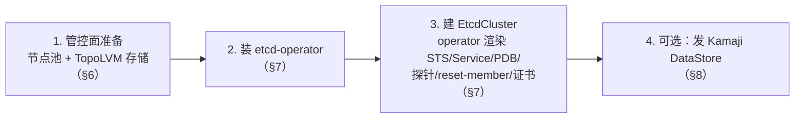
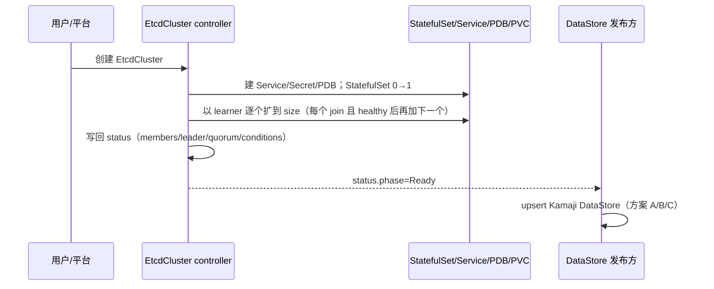
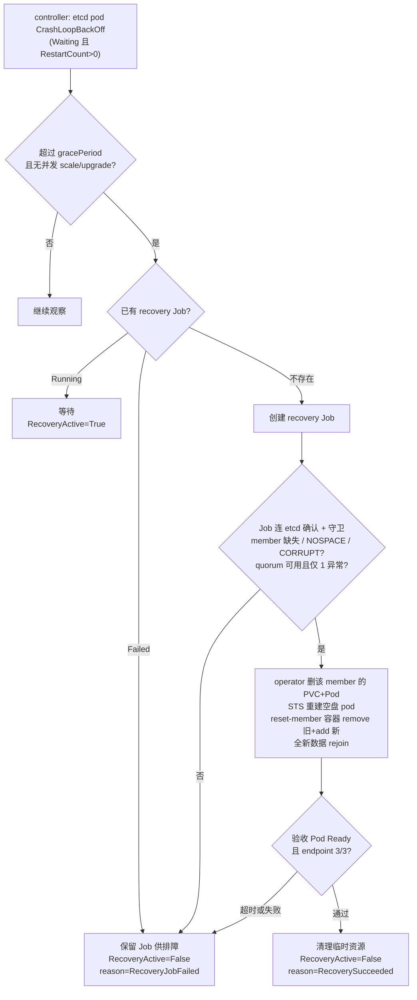

# ACP HCP etcd 设计

> 目标：让 ACP HCP hosted 控制面的 etcd 在 management 节点升级 / 维护（drain、换机、重启）时不丢 quorum，并支持 etcd 版本升级。以 OpenShift HCP（HyperShift）为对标。
> 基线：本仓库 `etcd-io/etcd-operator`，etcd `v3.6.5`，CRD `operator.etcd.io/v1alpha1`。
> 主线：对标 OCP（§2）→ 盘点差距（§3）→ CRD（§4）→ 总体部署 / 升级流程（§5）→ 高可用改造：管控面（§6）/ etcd-operator（§7）/ DataStore（§8）→ 工作流程（§9）→ 可观测与运维（§10）。

## 1. 目标 / 非目标

- **做**：把 `EtcdCluster` 提升到「节点升级时高可用」、支持 etcd 版本升级，并接入 Kamaji。
- **当前不做**（§12）：quorum 丢失恢复、自动 backup、TLS 证书轮换、自动 defrag、永久换机 / local PV 迁移。
- **不新增高层 CRD**：状态 / 调度 / PDB / 自愈都是通用 etcd HA 能力，属 `EtcdCluster`、可回上游；ACP 专属仅「发一个 Kamaji DataStore」，不值得单立 CRD。

## 2. 对标 OCP HCP（HyperShift）

HyperShift 把每个 hosted 控制面的 etcd 以 StatefulSet（默认 3 成员）跑在 management 集群。节点滚动升级靠以下几层不丢 quorum：

| HA 机制 | OCP 做法 |
| --- | --- |
| 状态可观测 | member / leader / health / quorum 汇聚 status |
| 就绪探针 | `:9980` `/readyz`（**serializable 本地健康**，`cluster-etcd-operator readyz` sidecar）/ `/healthz`；不依赖 quorum——否则一个 peer 挂会让健康 member 一起翻 NotReady。**不查 learner** |
| 调度分散 | anti-affinity + topology spread，member 散到不同节点 / 故障域 |
| PDB | HA `maxUnavailable:1` + `unhealthyPodEvictionPolicy:AlwaysAllow` |
| 低延迟存储 | **local PV / LVM**；SC 动态供给、`reclaimPolicy:Delete`，每节点给 etcd 专用快盘 |
| 成员级自愈 | `--enable-etcd-recovery`（默认开）：单 member 失败（quorum 在）删 PVC+Pod，重供空盘后由 `reset-member` initContainer remove+add 干净 rejoin |
| 自动 defrag | 仅 HA 跑 `etcd-defrag-controller`，一次只下线一个 member |

## 3. 差距盘点

`EtcdCluster` 底层 etcd 原语已具备，HA 层大多缺失：

| OCP 机制 | 现状 | 差距 |
| --- | --- | --- |
| 成员增删 / learner（原语） | ✅ `internal/etcdutils` 的 Add/Remove/Promote，**仅扩缩容用** | 无 |
| health / leader 探测 | ✅ 有，但仅 reconcile 内存用、未持久化 | 写进 status |
| 状态可观测 | ❌ 子资源已通，但 `EtcdClusterStatus` 空、从不写回 | 补 status 字段并写回 |
| 就绪探针 | ❌ 无 probe，Running 即 Ready | 加 readyz 探针 |
| 调度分散 | ❌ `podTemplate` 仅 metadata | 扩 podTemplate 调度字段 |
| PDB | ❌ 无 | 新增 |
| 低延迟存储 | ✅ `storageSpec.storageClassName` 支持 | 明确 SC 动态供给 + `reclaimPolicy:Delete`，优先 local/LVM |
| 成员级自愈 | ❌ 异常 member 只 requeue、不自动移除重建 | 新增单 member 恢复 |
| 自动 defrag | ❌ 无 | 后期 |
| 接入消费方 | ❌ 仅 headless Service（名 `<name>`） | 加 `<name>-client` Service + DataStore |

> TLS 已有 `cert-manager`（`auto` 待实现），Secret 命名 `<name>-{client,server,peer}-tls`，复用；轮换列后期。
> 差距分两块：通用 HA（§7，落 `EtcdCluster`、可回上游）+ 管控面配套（§6）；Kamaji 接入（§8，可选）。

## 4. EtcdCluster CRD

底层 etcd 集群对象，controller 据此渲染 StatefulSet / Service / ConfigMap / Secret / PVC（增强后含 PDB / `:9980` readyz 探针 / reset-member initContainer / client Service）并维护成员与状态。HA 改造只补字段：

| spec 字段 | 说明 | 状态 |
| --- | --- | --- |
| `size` | member 数；奇数，默认 3 | 现有 |
| `version` | etcd 版本（改它即触发版本升级，§5.2） | 现有 |
| `imageRegistry` | 私有 / 离线仓库 | 现有 |
| `storageSpec` | StorageClass + 容量（`volumeSizeRequest` 必填）；SC 约定见下 | 现有 |
| `tls` | 证书供给（`cert-manager` / `auto`） | 现有 |
| `etcdOptions` | 透传 etcd 启动参数 | 现有 |
| `podTemplate` | 调度：nodeSelector / tolerations / affinity / topologySpreadConstraints | **扩展**（当前仅 metadata） |
| `recovery` | 单 member 自动恢复开关与时限 | **新增** |

**StorageClass 约定**：SC 须动态供给 PV、`reclaimPolicy:Delete`（成员自愈删异常 PVC 后回收旧盘、重供空盘）；local/LVM 用 `volumeBindingMode:WaitForFirstConsumer`（PV 随 pod 调度、nodeAffinity 钉 hostname）。勿用静态绑定 + `Retain` 的 SC 承载自愈链路。

> **存储形态（对标 OCP）**：`volumeClaimTemplates` 给每个 member **独占一个 PV**（RWO），非共享卷。OCP 推荐每个控制面节点给 etcd **专用一块快盘（NVMe/SSD）**、用 LVM local SC（thin pool）切成每 pod 一个 LV；故同节点上**不同集群**的 etcd 各有独立 PV、但**共用底层物理盘**——① noisy-neighbor（同盘争 IOPS / `fdatasync`<10ms，靠盘够快 + 容量规划）；② 物理盘是共享故障域，但每集群 3 member 经 anti-affinity 散到 3 节点 3 盘，单盘故障每集群只丢 1 member。**红线：同集群两 member 不落同一物理盘。**

`status` 由 controller 维护（§7.1）。

## 5. 总体部署与升级流程

### 5.1 部署流程（概览）



1. **管控面准备**（§6）：为 HCP 管控节点建专用节点池（CAPI MachineDeployment + label），规划 IP/hostname/持久盘，装 TopoLVM 本地存储（StorageClass `sc-topolvm-vdc`）。
2. **装 etcd-operator**（§7）：带本设计的 HA 改造（status / readyz 探针 / 调度字段 / PDB / reset-member / client Service / 自愈）。
3. **建 EtcdCluster**（§7、§11 示例）：`size:3`、`storageClassName: sc-topolvm-vdc`、`nodeSelector` 钉管控节点 + 节点级 anti-affinity。operator 以 learner 逐个扩到 size（§9.1）。
4. **（可选）发 DataStore**（§8）：`status.phase=Ready` 后 upsert，给 Kamaji hosted apiserver 连。

### 5.2 升级流程（概览）

两类升级，机理不同、各自串行、互不并发：

| 升级 | 触发 | 机理 | 串行靠 | 详见 |
| --- | --- | --- | --- | --- |
| **节点滚动升级** | 管控集群升级 / 节点配置变更 | CAPI 逐个换 Machine（新机复用 IP/hostname/盘）→ drain 守 PDB → member 带原数据 rejoin | **PDB**（节点 drain 走 Eviction） | §6.3、§10 |
| **etcd 版本升级** | 改 `EtcdCluster.spec.version` | operator 下发新镜像 → StatefulSet RollingUpdate 逐序号 → 数据盘保留、新二进制重启 rejoin | **readyz 探针**（非 PDB，§7.4） | §7.5、§10 |

**两条保证（两类升级共用，缺一不可）**：

- **PDB**——中断（drain / 删 pod）某个 member 前，保证**其余 etcd 实例都可用**：任一时刻最多 1 个 member 被中断，quorum 不丢。
- **etcd 探针（readyz）**——保证一个 member 真正**已启动且是有效投票成员（leader / follower、非 learner）** 才算就绪；只有它就绪，才放行去动下一个。

二者合起来：**一次只动一个、且「动下一个」前确认上一个已是健康的投票成员**——这就是升级不丢 quorum 的核心。

- **节点滚动**：ACP 节点是 MicroOS、只滚动换机、不原地升级。换机复用旧节点 IP/hostname/数据盘（§6.2 Baremetal Provider 保证），故 etcd member **带原数据 rejoin、不是换机重建**；一次一节点（PDB `maxUnavailable:1`）。
- **etcd 版本升级**：etcd 仅支持**逐个 minor 滚动升级**（不能跨 minor，混版窗口只兼容相邻 minor）、且基本**不支持降级**。逐级升由升级流程保证，operator **硬校验只拦降级**（§7.5）。数据盘在 → reset-member 不触发、带原数据用新二进制起。
- **升级与自愈不打架**：滚动升级期间 member 被逐个重启、短暂下线属正常。故单 member 自愈（§9.2）有一条守卫——**StatefulSet 正在滚动更新时不启动恢复**，避免把升级中的正常重启误判为故障、去删 PVC 重建 member（那会和升级抢着动 pod、危及 quorum）。

> 失败 / 卡住的具体行为、何时人工介入、怎么排查——见 §10。

## 6. 高可用改造（一）· 管控面

HCP 管控节点与本地存储由管控面（CAPI + 存储插件）提供，是 etcd HA 的地基。

### 6.1 管控节点池

为 HCP 管控节点单独建 **CAPI MachineDeployment**，节点打 label **`cpaas.io/hcp-management-node: "true"`**（标识 + 供 EtcdCluster `nodeSelector` 钉选，§7.3）。在 **MachineConfigPool** 提前规划每个管控节点的 **IP、hostname、给 etcd 本地存储用的持久盘**（如 `/dev/vdc`）——这三者是滚动换机后 member 带原数据 rejoin 的基础（§6.2）。

### 6.2 TopoLVM 本地存储 + 换机复用盘

装两插件 **Alauda Container Platform Storage Essentials** + **Alauda Build of TopoLVM**，然后：

- 建 **TopolvmCluster CR**，按节点 IP 指定每节点用哪块盘，`useAll*: false` 显式选盘选节点：
  ```yaml
  apiVersion: topolvm.cybozu.com/v2
  kind: TopolvmCluster
  metadata: { name: topolvm }
  spec:
    useAllNodes: false
    useAllDevices: false
    useLoop: false
    storage:
      deviceClasses:
        - nodeName: 192.168.128.116
          classes: [{ className: vdc, default: true, devices: [{ name: /dev/vdc, type: disk }] }]
        - nodeName: 192.168.132.219
          classes: [{ className: vdc, default: true, devices: [{ name: /dev/vdc, type: disk }] }]
        - nodeName: 192.168.142.230
          classes: [{ className: vdc, default: true, devices: [{ name: /dev/vdc, type: disk }] }]
  ```
- 建 **StorageClass `sc-topolvm-vdc`**：动态供给、`reclaimPolicy:Delete`、`volumeBindingMode:WaitForFirstConsumer`、`device-class:vdc`：
  ```yaml
  apiVersion: storage.k8s.io/v1
  kind: StorageClass
  metadata:
    name: sc-topolvm-vdc
    labels: { topolvm.storageclass: default }
  provisioner: topolvm.cybozu.com
  parameters:
    csi.storage.k8s.io/fstype: xfs
    topolvm.cybozu.com/device-class: vdc
  reclaimPolicy: Delete
  volumeBindingMode: WaitForFirstConsumer
  allowVolumeExpansion: true
  ```
  一节点一专用盘 → 一节点一 member → 落实 §4 红线（同集群两 member 不落同盘）。

**换机复用盘的基础设施保证**：ACP **Baremetal Provider 保证滚动新节点复用旧节点的 IP、hostname、持久盘**。故升级时 **TopoLVM 无需变更、靠节点 IP 即识别新节点**，`/dev/vdc` 的 VG/LV 原样重挂；配合 `WaitForFirstConsumer` 的 PV（hostname nodeAffinity 仍匹配），member 换机后带原数据 rejoin。若用换机即清空的临时盘，则每次升级丢数据、退化为换机重建（§12）。

### 6.3 CAPI 节点 drain 必须守 PDB（`nodeDrainTimeout`）

CAPI 滚动升级 = 逐个删旧 Machine、起新 Machine。**删 Machine 前 CAPI drain 节点、走 Eviction API → 受 PDB 约束**：若驱逐 etcd member 会破坏 PDB（§7.4 `maxUnavailable:1`），eviction 被拒、drain 每 20s 重试，Machine 卡在 `Deleting`。是否最终强删取决于 `Machine.spec.nodeDrainTimeout`：

- **`0` / 未设（默认）= 无限 drain**：永不强删，PDB 一直挡到其余 member 全 Ready 才放行 → **安全**（代价：可能卡住、需人工修 etcd，§10）。
- **设了超时且到期**：CAPI **放弃 drain、照样删 Machine**（到点甚至 `--disable-eviction` 直接 delete、绕过 PDB）→ **破坏 quorum**。

> **硬性要求：`nodeDrainTimeout` 必须为 `0`（无限 drain）。** `0` 是 CAPI 默认值，故**只要不被设成非 0 即可、无需显式配置**；若某处已设了非 0 值，必须改回 `0` / 移除。**底线：绝不允许在 PDB 不满足时 drain 节点**——任何非 0 超时都会让 CAPI 到点放弃 drain、强删 Machine（绕过 PDB）→ 丢 quorum。
>
> **在哪确认**：它是 Machine spec 字段、不在 Node 上——看拥有这些节点的 machine 模板：etcd 所在管控节点池（§6.1 的 MachineDeployment）的 `spec.template.spec.nodeDrainTimeout`（in-place 传播到 MachineSet→Machine、不触发 rollout）；若 etcd 在控制面节点则看控制面 provider 的 `spec.machineTemplate.nodeDrainTimeout`。确认其为空或 `0`/`0s`。较新 CAPI 该字段在 `deletion` 块（`…spec.deletion.nodeDrainTimeout`），按 CAPI 版本确认路径。

## 7. 高可用改造（二）· etcd-operator

多数数据 / 逻辑已在进程内，主要是补字段与持久化。

### 7.1 填充 `status`

**现状**：status 子资源已通，但 `EtcdClusterStatus` 空、从不写回；每轮 reconcile 现查的 member/health 算完即弃，`kubectl get -o yaml` 看不到状态，排查只能翻日志或手连 etcd。
**改造**：reconcile 末尾把那份内存数据写回 `.status`（来自现有 `etcdutils`，管道 / RBAC 现成，只需加字段 + 写回），让运行态可见可排查（§10.1）：

```yaml
status:
  phase: Ready
  readyReplicas: 3
  memberCount: 3
  leaderID: "abc"
  members:
    - { name: branch-a-etcd-0, id: "abc", healthy: true, leader: true, learner: false, nodeName: node-a }
  recovery: { active: false, lastResult: Succeeded, lastRecoveredMember: branch-a-etcd-2 }
  conditions:
    - { type: EtcdClusterCreated,         status: "True" }
    - { type: EtcdClusterReady,           status: "True" }
    - { type: DataStoreReady,             status: "True" }
    - { type: QuorumAvailable,            status: "True" }
    - { type: SingleMemberDegraded,       status: "False" }
    - { type: SingleMemberRecoveryActive, status: "False" }
```

### 7.2 etcd 就绪探针

当前**无 probe**——Running 即 Ready，而 PDB / drain 安全 / healthy 计数 / 版本升级串行都依赖 Ready，故需让 **Ready = member 在服务且有投票资格**：不直接对 etcd httpGet，而是起一个 **`:9980` HTTPS 健康 server**（sidecar 或 operator），probe 打它：

- **liveness `GET :9980/healthz`**（period 5s / failureThreshold 5 / timeout 30s）：仅探活、宽容。
- **readiness + startup `GET :9980/readyz`**（readiness period 5s / failureThreshold 15；startup period 10s / failureThreshold 18）。
- `/readyz` 核心 = **serializable（本地）健康**：对本地 etcd 做 `Get("health", WithSerializable())`、**不依赖 quorum**——否则一个 peer 挂会让健康 member 一起翻 NotReady、放大故障；linearizable（默认 `/health`、`etcdctl endpoint health`）丢 quorum 会误判全部，必须避免。OCP 即用 `cluster-etcd-operator readyz` sidecar（`--target=https://localhost:2379 --listen-port=9980`）这套逻辑。
- **我们在其上加一条「非 learner」判定**（OCP 的 readyz 只查 serializable 健康、**不查 learner**，故 learner 也会判 Ready）：让新加入的 learner 在 promote 成 voting member 前保持 **NotReady**——不被 PDB 计为健康成员、不被 client Service 命中（`IsLearner` 本地可查、同样不依赖 quorum）。若不需要这层，可退回纯 OCP readyz。

> readyz 证"本地在服务"（加 learner 判定后再证"有投票资格"）、不证"quorum 健康"——故 PDB 仍保守（§7.4），recovery 的 quorum 判断走 controller 侧 `etcdutils`、不依赖 Ready。

### 7.3 扩展 `podTemplate` 调度字段

增加 `nodeSelector` / `tolerations` / `affinity` / `topologySpreadConstraints`，由平台侧填入。ACP 推荐 **`nodeSelector: cpaas.io/hcp-management-node: "true"`**（钉 HCP 管控节点，§6.1）+ hostname topology spread + 节点级 anti-affinity（固定节点级，避免「2 zone / 3 member」第 3 个 Pending）。

### 7.4 PDB

按 size 生成（3 → `maxUnavailable:1`）+ `unhealthyPodEvictionPolicy:AlwaysAllow`：健康 member 受 budget 约束；NotReady / 卡死 member 可在 drain 时被驱逐，不阻塞节点维护。前提是 §7.2 探针可靠；quorum 与恢复准入仍由 controller 侧 member health 判断。

> 3 member 时 `maxUnavailable:1`（=`minAvailable:2`）最多挂 1 个、护住 quorum。**PDB 只门控走 Eviction API 的自愿驱逐**（节点 drain，§6.3）；StatefulSet 滚动升级直接删 Pod、不经 Eviction → 不受 PDB 约束，版本升级串行靠 §7.2 readyz（§7.5）。

### 7.5 etcd 版本升级（改 `spec.version`）

改 `EtcdCluster.spec.version`：operator 每轮 `CreateOrPatch` 把新镜像下发到 StatefulSet → 默认 **RollingUpdate** 逐序号滚动，数据盘保留、etcd 带原数据用新二进制重启（reset-member 不触发）。

- **串行靠 readyz、不是 PDB**：STS 滚动更新由控制器**直接删 Pod、不走 Eviction → 不受 PDB 约束**；是 §7.2 `:9980/readyz`（healthy + 非 learner）让 RollingUpdate「每个 member 真就绪后才升下一个」，一次只动一个、quorum 保持。
- **版本约束**：
  - **升级必须逐个 minor 递进**（如 3.4→3.5→3.6，不可跳 minor）。**原因**：滚动升级期间集群处于**混版状态**（一部分 member 已是新版、一部分仍是旧版），而 etcd 只保证**相邻 minor**（N 与 N+1）之间的兼容——wire 协议、存储 / 快照格式、cluster version 都按此约定。跨 minor（如 3.4→3.6）会让相隔两个 minor 的 member 在混版窗口里同存，属 etcd **unsupported** 组合：新版 member 可能起不来 / 无法加入，甚至因格式不兼容损坏数据。逐级升能保证任一时刻混版只差一个 minor、始终落在兼容范围内。
  - **基本不支持降级**（仅个别版本有受限降级流程）。
  - **落地**：逐级递进由平台升级流程保证；operator **硬校验拦降级**（代价低、防手滑改小版本），跨 minor 前进可选加 guard。
- **升级中不误判**：§9.2 守卫含「无并发 scale/upgrade（STS 滚动中）」。

### 7.6 reset-member initContainer

每个 etcd pod 注入一个 init 容器，按**数据盘是否有 etcd db** 决定——这是「带原数据 rejoin」与「丢数据后干净重入」的开关：

- `/var/lib/etcd/member/snap/db` **存在** → 数据在，**不动**，带原数据正常 rejoin（节点换机 / 版本升级常态）。
- **不存在**（空盘）→ 若集群可达且成员表里还挂同名旧 member，则 `etcdctl member remove` 旧 ID + `member add` 新 peer（写 `initial-cluster-state=existing`）干净加入。**只对齐成员表、不删 PVC**。

它与 operator 删 PVC 的分工见 §9.2（自愈流程）：operator 清数据、reset-member 对齐成员表。

### 7.7 client Service

现有 headless `<name>`（`ClusterIP:None`、`PublishNotReadyAddresses:true`、无端口）给 **peer 发现**用——故意把未就绪 pod 也解析出来，不适合客户端。OCP 同样分两个 Service：`etcd-discovery`（发现）与 `etcd-client`（apiserver 连），我们缺后者。**改造**：新增 `<name>-client`——headless、**`publishNotReadyAddresses:false`**、2379 端口；用 headless（非 VIP）让客户端拿到所有就绪 member 做 failover，「只命中健康 member」依赖 §7.2 探针。DataStore `spec.endpoints` 用 `<name>-client.<ns>.svc:2379`。

### 7.8 单 member 自动恢复（开关）

轻量配置；破坏性动作放一次性 Job（模仿 HyperShift），controller 读 Job `Complete/Failed` 同步 status。流程见 §9.2。

```yaml
spec:
  recovery:
    enabled: true
    gracePeriod: 10m     # 异常持续多久才恢复，避免 reboot 误判
    timeout: 30m
    maxRetries: 3
```

## 8. 高可用改造（三）· DataStore 发布（ACP 专属，可选）

DataStore 是个连接器对象，内容固定：

```yaml
apiVersion: kamaji.clastix.io/v1alpha1
kind: DataStore
metadata: { name: branch-a-etcd }      # cluster-scoped，名称需全局唯一
spec:
  driver: etcd
  endpoints: [ branch-a-etcd-client.hcp-system.svc:2379 ]   # 来自 §7.7 client Service
  tlsConfig:                             # 指向 <name>-client-tls 与其 CA
    certificateAuthority: { ... }
    clientCertificate: { ... }
```

改造已让 endpoint 与证书 Secret 命名稳定可预测，故「谁来生成」可替换，三种放法：

| 方案 | 形态 | 取舍 |
| --- | --- | --- |
| **A. 手动 / 声明式** | `kubectl apply` 或部署模板写死 | 零代码兜底；适合集群少、不频繁变动 |
| **B. Kamaji provider 里 watch** ✅ 倾向 | 放进 `cluster-api-control-plane-provider-kamaji`，watch `EtcdCluster`、`status.phase=Ready` 后 upsert | 职责归位：etcd-operator 不碰 Kamaji 类型、保持可上游；`usedBy` / 删除保护 / schema 绑定更直接 |
| **C. operator 内独立 reconciler** | 与核心 reconciler 解耦，build tag / 开关控制 | 同进程读 status 最直接，但给 fork 引入 Kamaji 依赖 |

**触发**（B/C）：watch EtcdCluster + annotation（`hcp.alauda.io/datastore: <name>`），或由 provider 从 `KamajiControlPlane` 反查。三者对 `EtcdCluster` 透明、可切换，都不给 `EtcdCluster.spec` 加 Kamaji 字段。`dataStoreSchema`（db 名 / key prefix）属 Kamaji 控制面，唯一性绑定时校验。

## 9. 工作流程

### 9.1 创建



1. 平台创建 `EtcdCluster`（带 HA 调度字段，按需带 `hcp.alauda.io/datastore` annotation）。
2. controller 建 Service / Secret / PDB；StatefulSet 0→1，再以 learner 逐个扩到 `size`——每个 join 且 healthy 后才加下一个，保证扩容期 quorum 安全。
3. controller 把 member / leader / health / quorum 写回 `status`。
4. `status.phase=Ready` 后，发布方按方案 A/B/C upsert Kamaji DataStore。

### 9.2 单 member 自动恢复

> **作用域（ACP 与 OCP 的差异）**：ACP 滚动换机后 **PV/PVC 仍在、数据盘原样挂回**（§6.2），member 拿原数据重建 pod 即**自动 rejoin**（reset-member no-op，§7.6）——绝大多数节点变更**无需走本节恢复**。**单 member 自动恢复只兜「数据真的坏了 / 丢了」**（如盘挂回但 etcd 加载 db 失败、CrashLoop）。OCP 把它当常规自愈手段，是因为其节点替换场景下**新节点拿不到旧 PV 数据**（换机≈丢盘、必须重建 member）；ACP 靠 §6.2 复用盘规避了这点。

**检测（两段式）**：

- **触发**（controller，纯看 k8s 状态）：某 etcd pod CrashLoopBackOff（`State.Waiting` 且 `RestartCount>0`）即触发，不连 etcd。
- **确认**（recovery Job，连 etcd）：查 `MemberList`（谁缺失）+ 逐 member `Get("health")` 与 `AlarmList`（`NOSPACE`/`CORRUPT`）+ failing pod，任一成立判 unhealthy。

> 判健康用 **pod 重启状态 + etcd alarm**，不是 §7.2 探针（那个给 PDB/drain）。OCP 触发即动手、无 grace period；我们加 `gracePeriod` 去抖，避免把 reboot / 短暂 drain 误判为故障。

**operator 删 PVC 与 reset-member 的分工**（一次自愈的两半、必须 operator 先）：operator 仅在自愈路径（守卫见下）删该 member 的 PV+PVC+Pod（**正常 reboot / 换机 / 版本升级时不删**）→ STS 重建空盘 pod → reset-member（§7.6）因盘空进入 remove+add。即 **operator 删 PVC 正是把 reset-member 从「数据在→no-op」切到「数据空→重置成员」的开关**：operator 清数据（有全局守卫），reset-member 对齐成员表（pod 本地、幂等）。init 容器不能自删 PVC（finalizer 挡 + 无守卫易误抹）；remove→add 间成员表短暂 3→2，故守卫坚持仅 1 异常。

<details>
<summary>recovery Job 健康检查 YAML 示例</summary>

```yaml
apiVersion: v1
kind: ServiceAccount
metadata:
  name: etcd-health-check
  namespace: hcp-system
---
apiVersion: rbac.authorization.k8s.io/v1
kind: Role
metadata:
  name: etcd-health-check
  namespace: hcp-system
rules:
  - apiGroups: [""]
    resources: ["pods"]
    verbs: ["get", "list"]
---
apiVersion: rbac.authorization.k8s.io/v1
kind: RoleBinding
metadata:
  name: etcd-health-check
  namespace: hcp-system
subjects:
  - kind: ServiceAccount
    name: etcd-health-check
    namespace: hcp-system
roleRef:
  apiGroup: rbac.authorization.k8s.io
  kind: Role
  name: etcd-health-check
---
apiVersion: batch/v1
kind: Job
metadata:
  name: etcd-health-check
  namespace: hcp-system
spec:
  backoffLimit: 0
  template:
    spec:
      restartPolicy: Never
      serviceAccountName: etcd-health-check
      containers:
        - name: check
          # 示例镜像需同时包含 etcdctl 与 kubectl。
          image: your-image-with-etcdctl-and-kubectl:latest
          command:
            - /bin/bash
            - -c
            - |
              set -euo pipefail

              export ETCDCTL_API=3
              unhealthy=0

              etcdctl_one() {
                local ep="$1"
                shift
                etcdctl \
                  --endpoints="${ep}" \
                  --cacert="${ETCDCTL_CACERT}" \
                  --cert="${ETCDCTL_CERT}" \
                  --key="${ETCDCTL_KEY}" \
                  "$@"
              }

              echo "== etcd health/alarm check =="
              for i in $(seq 0 $((ETCD_REPLICAS - 1))); do
                ep="${ETCD_SCHEME}://${ETCD_STS_NAME}-${i}.${ETCD_HEADLESS_SERVICE}.${ETCD_NAMESPACE}.svc.cluster.local:2379"
                echo "checking ${ep}"

                if ! etcdctl_one "${ep}" get health --consistency=s >/dev/null; then
                  echo "[UNHEALTHY] Get(\"health\") failed on ${ep}"
                  unhealthy=1
                fi

                if ! alarm_out="$(etcdctl_one "${ep}" alarm list 2>&1)"; then
                  echo "[UNHEALTHY] AlarmList failed on ${ep}"
                  echo "${alarm_out}"
                  unhealthy=1
                elif echo "${alarm_out}" | grep -E '\b(NOSPACE|CORRUPT)\b' >/dev/null; then
                  echo "[UNHEALTHY] critical alarm found on ${ep}:"
                  echo "${alarm_out}"
                  unhealthy=1
                fi
              done

              echo "== pod check =="
              if ! pod_lines="$(kubectl -n "${ETCD_NAMESPACE}" get pods -l "${ETCD_POD_SELECTOR}" --no-headers 2>&1)"; then
                echo "[UNHEALTHY] failed to list etcd pods"
                echo "${pod_lines}"
                unhealthy=1
              else
                bad_pods="$(
                  echo "${pod_lines}" | awk '
                    {
                      split($2, ready, "/")
                      if ($3 != "Running" || ready[1] != ready[2]) print $0
                    }
                  '
                )"
                if [[ -n "${bad_pods}" ]]; then
                  echo "[UNHEALTHY] failing/unready pods:"
                  echo "${bad_pods}"
                  unhealthy=1
                fi
              fi

              if [[ "${unhealthy}" -ne 0 ]]; then
                echo "RESULT: unhealthy"
                exit 1
              fi
              echo "RESULT: healthy"
          env:
            - { name: ETCD_NAMESPACE,        value: hcp-system }
            - { name: ETCD_STS_NAME,         value: branch-a-etcd }
            - { name: ETCD_HEADLESS_SERVICE, value: branch-a-etcd }
            - { name: ETCD_REPLICAS,         value: "3" }
            - { name: ETCD_SCHEME,           value: https }
            - { name: ETCD_POD_SELECTOR,     value: app.kubernetes.io/instance=branch-a-etcd }
            - { name: ETCDCTL_CACERT,        value: /etc/etcd/tls/ca.crt }
            - { name: ETCDCTL_CERT,          value: /etc/etcd/tls/tls.crt }
            - { name: ETCDCTL_KEY,           value: /etc/etcd/tls/tls.key }
          volumeMounts:
            - { name: etcd-client-tls, mountPath: /etc/etcd/tls, readOnly: true }
      volumes:
        - name: etcd-client-tls
          secret:
            secretName: branch-a-etcd-client-tls
```

</details>

**守卫**：仅当 quorum 可用、恰好 1 member 异常、且无并发 scale/upgrade（STS 不在滚动更新）时才恢复。



1. controller 检测某 etcd pod CrashLoopBackOff（`Waiting` 且 `RestartCount>0`）。
2. 持续超 `gracePeriod` 且无并发 scale / upgrade / recovery；否则继续观察。
3. 按已有 recovery Job 状态：Running 等待；Failed 保留供排障、不自动重试；不存在则创建。
4. Job 连 etcd 确认并守卫：member 缺失或 `NOSPACE`/`CORRUPT` 判异常；若 quorum 不可用或 ≥2 member 异常 → Job 失败（需人工）。
5. 恢复动作：**operator 删**该 member 的 PVC（`etcd-data-<pod>`）+ Pod → SC 按 `reclaimPolicy:Delete` 回收旧 PV → STS 重建**空盘** pod；其 **reset-member initContainer** 因盘空 `member remove`(旧 ID) + `member add`(新 peer) → etcd 以全新数据 rejoin。
6. controller 验收 Pod Ready、endpoint health 3/3。
7. 通过则清理、置 `RecoveryActive=False`/`RecoverySucceeded`、更新 `status.recovery`；超时 / 失败置 `RecoveryJobFailed`、不自动重试。

≥2 member 异常或 quorum 丢失：只告警，不自动恢复。

## 10. 可观测与运维

### 10.1 哪里看实时状态

| 看什么 | 命令 / 位置 |
| --- | --- |
| 节点 / 换机进度 | `kubectl get machines`（CAPI Machine `phase`；卡 `Deleting` = drain 被 PDB 挡，§6.3）、`kubectl get nodes` |
| etcd 集群运行态 | `kubectl get etcdcluster <name> -o yaml` → `status`：`phase` / `members[]`(healthy/leader/learner/nodeName) / `leaderID` / `recovery` / `conditions`（§7.1） |
| etcd 直连核对 | `etcdctl member list -w table`（缺谁 / learner）、`endpoint health`、`endpoint status`（leader/raftTerm）、`alarm list`（NOSPACE/CORRUPT） |
| 就绪 / quorum | Pod Ready（= readyz：healthy + 非 learner，§7.2）；`QuorumAvailable` condition |
| PDB | `kubectl get pdb <name>`（`ALLOWED DISRUPTIONS`=0 即正挡驱逐） |
| 自愈 | `status.recovery`、recovery Job（`kubectl get job`）、reset-member 容器日志（§10.4） |

### 10.2 升级失败 / 卡住的行为（不是崩溃重试，是稳定等待）

- **节点滚动**：CAPI drain 走 Eviction、PDB 拒绝违反预算的驱逐 → **Machine 卡在 `Deleting`、每 20s 重试 drain**（稳定等待、非崩溃循环）。`nodeDrainTimeout=0` → 无限等到 PDB 放行；**设了超时到期 → CAPI 强删、破坏 quorum**（故须 0，§6.3）。
- **etcd 版本升级**：RollingUpdate 若某 member readyz 不过 → **StatefulSet 停在该序号、不前进**（也不强推，无 PDB 但 readyz 门控）；该 member 恢复就绪后才继续下一个。
- **单 member 自愈**：recovery Job `Failed` → **保留供排障、不自动重试**（不是无限重启）；`gracePeriod` 内的抖动不触发。
- **降级被拒**：operator 硬校验拒绝降级，不会进入滚动；跨 minor 前进由升级流程逐级保证（§7.5）。

### 10.3 何时需要人工介入

| 触发 | 现象 | 处置 |
| --- | --- | --- |
| **升级长时间未完成**（经验值：**>2h** MachineDeployment 仍未 fully ready） | MD `updatedReplicas`/`readyReplicas` 长期 < `replicas`。注意 **MD 没有「超时自动把 `status.phase` 置 `Failed`」的机制**（不像 ModuleInfo），不会自己报错 | 人工介入：看 **MD `status` + etcd-operator 日志** 排查（顺 §10.4：Machine `DrainingSucceeded` → PDB → 哪个 member 没就绪） |
| **quorum 丢失（≥2 member 异常）** | `QuorumAvailable=False`；自愈只告警不动手 | snapshot 恢复（§12），期间 API 不可用 |
| **节点 drain 长期卡住** | Machine 卡 `Deleting`、PDB `ALLOWED DISRUPTIONS=0` | 查其余 member 为何没 Ready；等 §9.2 自愈 / 人工修复，**切忌 force delete 跳过 PDB / 误设 `nodeDrainTimeout`** |
| **recovery Job Failed** | `reason=RecoveryJobFailed`、不自动重试 | 看 Job 日志定位，手动修复后删 Job 重试 |
| **数据盘没重挂** | reset-member 反复 `removing/Adding`、member 反复全量同步 | 查 Baremetal Provider 是否真复用了旧盘 / hostname（§6.2） |
| **降级被拒** | apply 报错（改小了 version） | 降级基本不支持；如确需走 etcd 受限降级流程 |

### 10.4 排查手册

- **reset-member 容器日志**：`member has data` = 带原数据 rejoin（常态）；`removing / Adding new member` = 该 member 数据丢失后干净重入（异常，查盘是否真重挂）。
- **member 缺失 / learner 卡住**：`etcdctl member list`；learner 长期不 promote → 查与 leader 的 revision 差（catch-up 是否卡）。
- **节点升级不动**：先看 `kubectl get machines` 是否卡 Deleting、再看 `kubectl get pdb`（ALLOWED=0）、再看哪个 member 没 Ready（readyz）。
- **alarm**：`NOSPACE` → 加盘 / defrag；`CORRUPT` → 该 member 走自愈重建（§9.2）。

## 11. 完整示例

带 HA 调度保护、开启恢复的 `EtcdCluster`（annotation 仅方案 B/C 自动发布时需要）：

```yaml
apiVersion: operator.etcd.io/v1alpha1
kind: EtcdCluster
metadata:
  name: branch-a-etcd
  namespace: hcp-system
  annotations:
    hcp.alauda.io/datastore: branch-a-etcd     # 仅方案 B/C 自动发布时需要
spec:
  size: 3
  version: v3.6.5
  imageRegistry: harbor.alauda.cn/ait
  storageSpec:
    storageClassName: sc-topolvm-vdc           # §6.2 TopoLVM SC（动态供给、reclaimPolicy=Delete）
    volumeSizeRequest: 8Gi
  tls:
    provider: cert-manager
    providerCfg:
      certManagerCfg: { issuerKind: Issuer, issuerName: etcd-issuer }
  podTemplate:                                  # §7.3 扩展的调度字段
    spec:
      nodeSelector: { cpaas.io/hcp-management-node: "true" }   # 钉 HCP 管控节点（§6.1）
      topologySpreadConstraints:
        - { maxSkew: 1, topologyKey: kubernetes.io/hostname, whenUnsatisfiable: DoNotSchedule, labelSelector: { matchLabels: { app: branch-a-etcd } } }
      affinity:
        podAntiAffinity:
          requiredDuringSchedulingIgnoredDuringExecution:
            - { topologyKey: kubernetes.io/hostname, labelSelector: { matchLabels: { app: branch-a-etcd } } }
  recovery: { enabled: true, gracePeriod: 10m, timeout: 30m, maxRetries: 3 }
```

> 管控节点的 CAPI machine 模板须确保 `nodeDrainTimeout` 为 `0`（默认即 0，不被设成非 0 即可，§6.3）。

## 12. 后期增强

- **backup**：`EtcdCluster.spec` 扩展定期快照（`schedule` / `retention` / `objectStorageRef`）；需 snapshot Job/CronJob、状态校验、对象存储上传、retention 清理、stale/failed 告警。
- **TLS 证书轮换**：当前 `tls` 只是证书供给。轮换流程——证书 Secret / Certificate 变化 → 确认 quorum healthy → 按 member 串行 reload / rolling restart → 每个恢复后查 endpoint health / member list → 全部完成更新 rotation condition。
- **自动 defrag**：对齐 OCP `etcd-defrag-controller`，按周期 / db 大小阈值串行 defrag，确保 quorum 健康、一次只动一个，仅 HA（size≥3）启用。
- **永久换机 / local PV 迁移**：节点被永久替换、local PV 丢失（非 §6.2 的复用盘）时，在新节点以全新数据重建 member（remove + learner add/rejoin）并重新供给 PV。比单 member 临时恢复更重，单独设计。

## 13. 参考

- 底层实现：`api/v1alpha1/etcdcluster_types.go`、`internal/controller/etcdcluster_controller.go`、`internal/etcdutils/`
- Kamaji CRD：`chart/charts/kamaji/templates/crds/`
- CAPI 节点 drain / PDB / `nodeDrainTimeout`：<https://cluster-api.sigs.k8s.io/tasks/automated-machine-management/machine_deletions>
- OCP HCP / HyperShift hosted etcd：
  - 单 member 自愈 / DR：<https://hypershift.pages.dev/how-to/disaster-recovery/etcd-recovery/>
  - etcd snapshot backup（Tech Preview）：<https://hypershift.pages.dev/how-to/disaster-recovery/etcd-snapshot-backup/>
  - reset-member / 探针 / PDB：`openshift/hypershift` `control-plane-operator/.../v2/{etcd,assets/etcd}`、`support/controlplane-component`
  - `:9980` readyz 实现（serializable Get、**不查 learner**）：`openshift/cluster-etcd-operator` `pkg/cmd/readyz/readyz.go`
  - 存储建议（local / LVM）：<https://docs.okd.io/latest/hosted_control_planes/hcp-deploy/hcp-deploy-virt.html>
  - etcd 健康端点：<https://etcd.io/docs/v3.5/op-guide/monitoring/>
